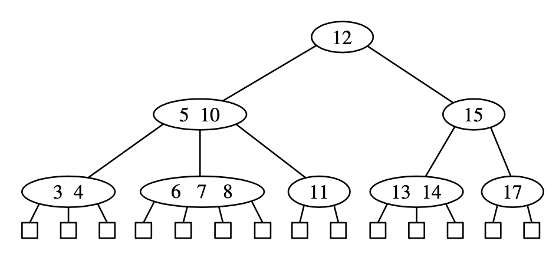
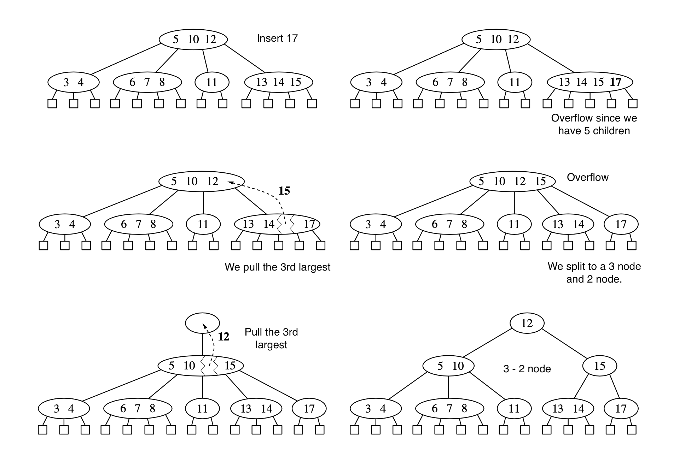
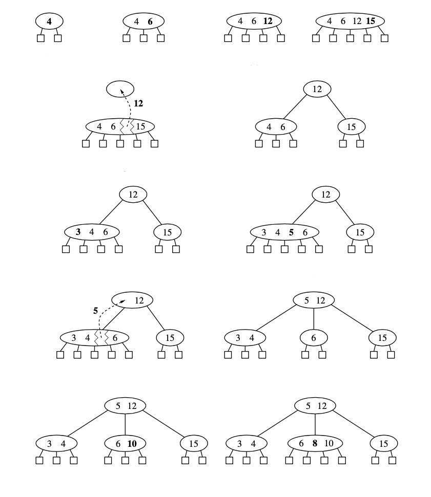
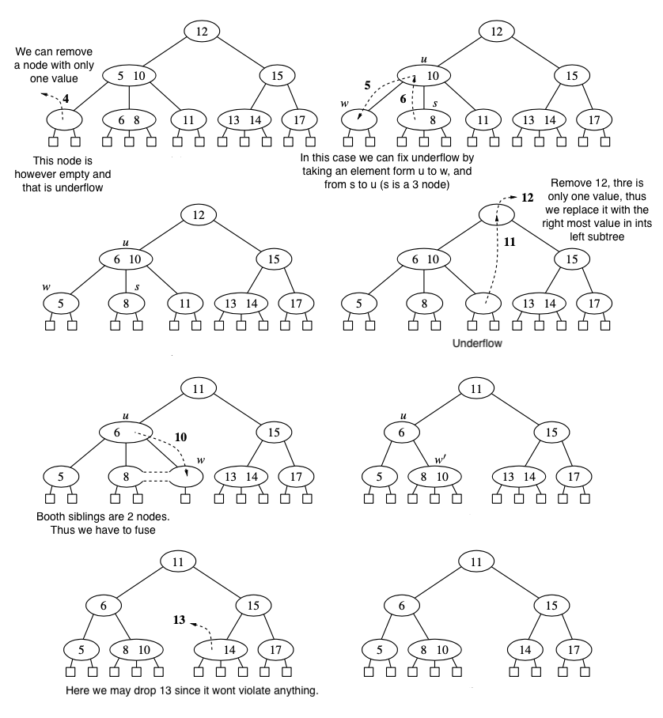

# (2,4) Trees
It is a class of more general structure known as [multiway search tree](multiway_search_tree.md), in which nodes may have more than two children. At each node we store multiple sorted key values pairs while having the tree balanced. To achieve this we have to satisfy the following properties:

1. **Size property**: Every internal node has at most four children
2. **Depth property**: All the external nodes have the same depth
   

Here we assume that external nodes are empty.

*The height of a (2,4) tree storing n items is $O(\log n)$* This is sufficient to keep the tree balanced. 

## Insertion
To insert a new item (k,v) into a tree T we first search for k. If k is not present we unsuccessfully we terminate at an external node z. Than we insert a new item into node we and add a new child y to we on the left of z. This insertion method preserves the depth property, since we add a new external node at the same time. If node we was a 4-node, then we would violate the size property (**overflow**) at node w, and we need to resolve it.  Let $c_1, \cdots, c_5$ be children of w and let $k_1, \cdots, k_4$ be already stored at w. Here we need to perform a **split** operation at w as follows:
* Replace w with two nodes $w'$ and $w''$ where:
  * $w'$ is a 3 node with children $c_1, c_2, c_3$ storing keys $k_1, k_2$
  * $w''$ is a 2-node with children $c_4, c_5$ storing key $k_4$
* If w is the root of T, create a new root node u, else u be the parent of w.
* Insert $k_3$ into u and make $w'$ and $w''$ children of u, so if w was child of i of u, then $w'$ and $w''$ becomes children of $i$ and $i+1$ of u respectively.
After split an new overflow can occur at the parent u of $w$. Thus an overflow either terminates or propagates it into the parent of current node. 

Example of growing a new tree:

## Deletion

First we find the key we want to delete. If the node is an internal node, and it has only one value, than we find the right most node in its left subtree and we put its value instead of the deleted key. (This is similar to deletion in a regular search tree)

If the item to remove is stored at a node w with only external-node children, we simply remove the item from w and remove the $i^{\text{it}}$ external node of $w$. This removal operation preserves the depth property, since we always remove an external child from a node w with only external children. This may violate the size property of $w$. Thus a 2 node may become an 1 node with no items after removal (**underflow** at an node), and is not allowed. 

We can fix underflow if an immediate sibling of w is a 3-node or a 4-node. If we have such an sibling we perform an transfer operations where we move a child of $s$ to $w$, a key of $s$ to the parent $u$ of $w$ and $s$, and a key of $u$ to $w$. 

If $w$ has only one sibling, or if booth immediate siblings are 2-nodes than we perform fusion, in which we merge w with a sibling, creating a new node $w'$, and move a key from the parent of u of w to $w'$. Fusion at node $w$, may cause a new underflow to occur at the parent of u and w, which in turn triggers a transfer or fusion at u. Hence the number of fusion operations is bounded by the height of the tree. If underflow propagates to the root, we just simply remove the root. 