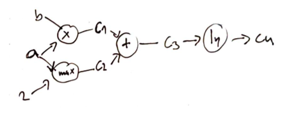
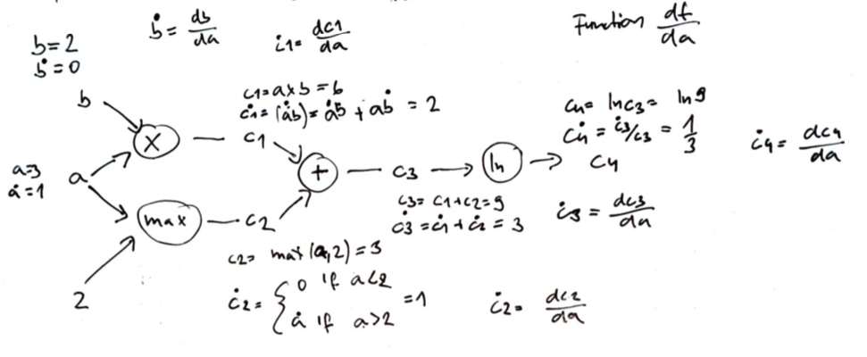
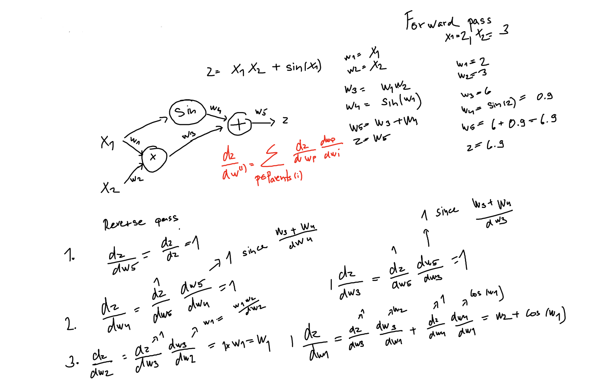

# Automatic symbolic differentiation

Automatic differentiation is just the application of the chain rule:

$$
\frac{d}{dx} f(g(x)) = \frac{d}{dx}(f \circ g)(x) = \frac{df}{dg} \frac{dg}{dx}
$$

We can create a program, that is composed of elementary operations like addition, subtraction, division, etc, to perform automatic symbolic differentiation. 

> Example
> $$f(a,b) = \ln (ab + \max(a, 2)) \\ \frac{\partial f}{\partial a} = \frac{\partial}{\partial a} \ln (ab + \max(a, 2)) \\ = \frac{1}{ab + \max(a, 2)} \frac{\partial}{\partial a} (ab + \max(a,2)) \\ = \frac{1}{ab + \max(a, 2)} \ Bigg[\frac{\partial (a,b)}{\partial a} + \frac{\partial \max(a,2)}{\partial a}\Bigg] \\ = \frac{1}{ab + \max(a, 2)} \Bigg[\Big(b \frac{\partial a}{\partial a} + a \frac{\partial a}{\partial a} \Big) + \Big( (2 > a) \frac{\partial 2}{\partial a} +  (2 < a)\frac{\partial a}{\partial a} \Big) \Bigg] \\ = \frac{1}{ab + \max (a ,2)}+ \Big[b + (2 < a) \Big]$$

## Computational graph
This process can be automated using a computational graph. A computational graph represents a function where the nodes are operations and the eges are input output relationships. The leaf nodes are inputs or constants.

There are two possible implementations of computational graphs for a differentiable function $f$
1. Foward accumulation
2. Backward accumulation

## Forward accumulation

We can automatically differentiate a function using a single forward pass trough the functions computational graph. This is equivalent to iteratively expand the chain rule of the inner operation:

> Example for function $f(a,b) = \ln (ab + \max(a, 2))$
> $$
\frac{d f}{d x} = \frac{d f}{d c_4} \frac{d c_4}{d x} = \frac{d f}{d c_4}\Big( \frac{d c_4}{dc_3} \frac{dc_3}{dx}\Big) = \frac{d f}{d c_4}\Big[ \frac{d c_4}{dc_3} \Big( \frac{dc_3}{dc_2}\frac{dc_2}{dx} + \frac{dc_3}{dc_1}\frac{dc_1}{dx} \Big) \Big]
$$

### Algorithm 
Start at the graph source nodes consisting of the function inputs and any constant values. For each of these nodes, we note booth the value and the appropriate derivative with respect to our target variable
2. Than we process down the tree, one node at a time, choosing a node whose inputs have already been computed. Now we continue as in step 1. 

This process can be automated (coded), where at each operation we produce booth the value and its derivative. These pairs are called dual number. Dual numbers can be mathematically expressed as $\epsilon$ where $\epsilon^2 = 0$. Dual numbers like complex number are written as $a + b\epsilon$ where $a$ and $b$ are real. Addition and multiplication for dual numbers is as follows:
$$
(a + b\epsilon) + (c+d\epsilon) = (a+c) + (b+d)\epsilon \\
(a + b\epsilon) \times (c+d\epsilon) = (ac) + (ad + bc) \epsilon
$$

If we pass a dual number into any smooth function $f$, we get the evaluation and its derivative. This can be show by performing an Taylor expansion:

$$
f(x) = \sum_{k=0}^{\infty} \frac{f^{k}(a)}{k!} (x - a)^k
$$
$$
f(a + b\epsilon) = \sum_{k=0}^{\infty} \frac{f^{k}(a)}{k!} (a + b\epsilon - a)^k
$$
$$
= \sum_{k=0}^{\infty} \frac{f^{(k)}(a)b^k\epsilon^k}{k!} = f(a) + bf'(a)\epsilon + \epsilon^2\sum_{k=2}^{\infty} \frac{f^{(k) }(a)b^k}{k!} \epsilon^{(k-2)} = f(a) + bf'(a)\epsilon
$$

# Reverse accumulation
Forward accumulation requires n passes in order to compute n-dimensional gradients. Reverse accumulation requires a single pass to compute the complete gradient, but requires two passes through the graph. 
1. Forward pass during which all the intermediate  variables are computed
2. Backward pass computes the gradient. 

Reverse accumulation is preferred over forward accumulation where gradient is needed, however we need to be careful on memory constrained systems with large graphs.

Reverse accumulation computes the partial derivative with respect to the chosen variable, iteratively substitutes the outer function.

> Example of an reverse pass

$$
\frac{df}{dx} = \frac{df}{dc_4} \frac{dc_4}{dx} = (\frac{df}{dc_3} \frac{dc_3}{dc_4}) \frac{dc_4}{dx} = \Bigg(\Big [ (\frac{df}{dc_2}  \frac{dc_2}{dc_3}) + (\frac{df}{dc_1} \frac{dc_1}{dc_3}) \Big] \frac{dc_3}{dc_4} \Bigg) \frac{dc_4}{dx}
$$

> It requires intermediate values that are obtained during an forward pass.

Reverse accumulation can be implemented using operator overloading. Two function have to be implemented for each fundamental operation
1. Forward operation, which stores the gradient information during the forward pass
2. Backward operation, uses the stored information to propagate the gradient back.

The key idea is to remember:

$$
\frac{dz}{w^{(i)}} = \sum_{p \in \text{parents}(i)} \frac{dz}{dw^{(p)}} \frac{dw^{(p)}}{dw^{(i)}}
$$