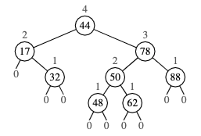
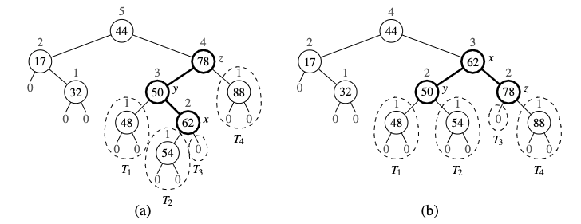
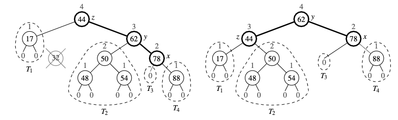

# AVL tree

We achieve a [balanced tree](balanced_search_trees.md) by introducing a constraint of logarithmic height of the tree. 

**Height-Balance property** 
For every position p of T, the height of the children (siblings) of p differ by at most 1.

Any binary search tree T that satisfies the height-balance property is said to be an **AVL tree**. 



The height of the nodes is above the node

## Update operations
Deletion an insertions are similar to standard binary trees, but we need to perform corrections so we satisfy the height balance property.

### Insertion
Insertion is the same as with the binary search tree, thus it results in a new node at position p, but may violate the height-balance property, but the only positions that may become unbalanced are the ancestors of p, because they are the only positions whose subtree has changed. 



This fix is done by going up from the newly inserted position p until we find the first position z that is unbalanced. We take the child of z, y that has higher height (y has to be an ancestor of p), now we take a child of y, with higher position x. (this has to be an ancestor of p or p itself). We re-balance the subtree rooted at z by calling the *trinode restructuring*.

### Deletion
Removal of a node can may violate the height-balance property in an AVL tree. In particular, if position p represents the parent of removed node in tree T, they may be an unbalanced node on the path from p to the root of T. In fact, there can be at most one such unbalanced node.



As with insertion we use *trinode restructuring* to restore balance in the tree T. Let z be the first unbalanced position encountered going up from p towards to the root of T, let y be the child of z with larger height (position y is the child of z and it is not an ancestor of p), let x be the left child of y on the same side as y; else (booth children of y have the same height), let x be the child of y on the same side as y (that is, if y is the left child of z, then x be the left child of y, else let x be the right child of y). In any case, we perform a $restructure(x)$ operation. Unfortunately this may only restore height-balance property **locally**. Thus we have to still walk up T till we get to the root.

## Performance
* These operation work in $O(\log n)$: 
  ```
  k in T, T[k], T[k] = v, T.delete(p), del T[k], T.find_position(k), T.first(), T.last(), T.find_min(), T.find_max(), T.before(k), T.after(k), T.find_lt(k), T.find_le(k), T.find_gt(k), T.find_ge(k), 
  ```

* These operations work in $O(s + h)$: 
  ```
  T.find_range(start, stop)
  ```
* These operations work in $O(n)$: 
  ```
  iter(T), reversed(T)
  ```
