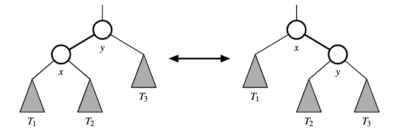
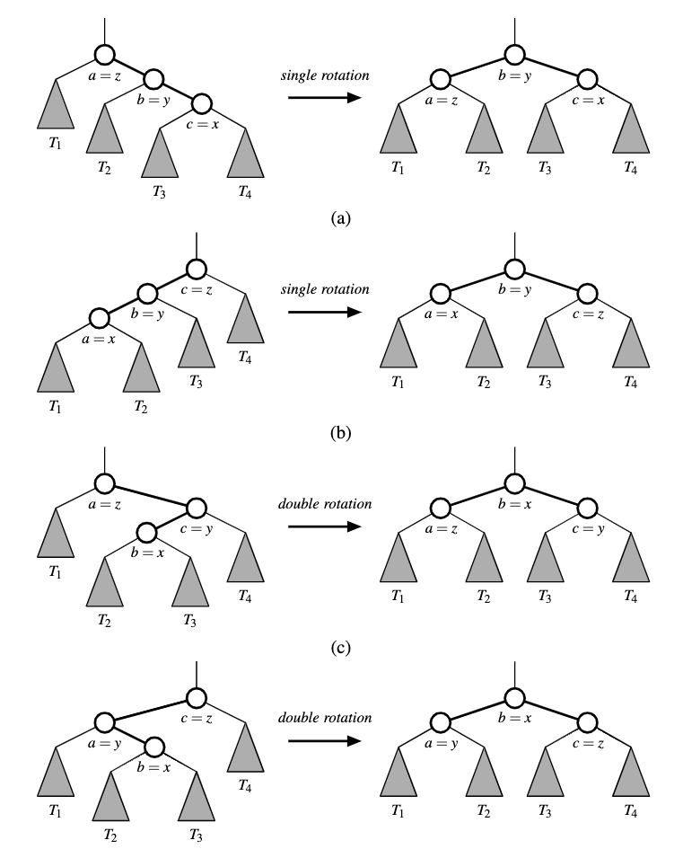

# Balanced Search Trees

Balanced [search trees](search_trees.md) try to keep its height equal $h=[\log (n+1)] - 1$, where n is the number of nodes.

The primary operation to re-balance a tree is known as **rotation**. During rotation we "rotate" a child to be above its parent.

We can preform two kinds of rotations
1. Transform the left formation to into the right
2. Transform the right rotation to the left 

In the example $T_1$ has keys less than that of position x, $T_2$ has keys that are between x and y. And $T_3$ has keys greater than at position y.

To maintain the binary search tree property trough a rotation we note that if position x was a left child of position y prior to a rotation (and therefore the key of x is less than the key of y), then y becomes the right child of x after the rotation and vice versa. 

A single rotation modifies a constant number of parent-child relation-ship, it can be implemented in $O(1)$ time with a linked binary tree representation.

We can combine multiple rotations to provide broader re-balancing within a tree. An example is a **trinode restrucutre** ($O(1)$) where we consider a position x, its parent y and grand parent z. 

Algorithm restructure(x):

Input: A position x of a binary search tree T that has both a parent y and a grandparent z

Output: Tree T after a trinode restructuring (which corresponds to a single or double rotation) involving positions x, y,and z

1. Let (a, b, c) be a left-to-right (inorder) listing of the positions x, y,and z,and let (T1,T2,T3,T4) be a left-to-right (inorder) listing of the four subtrees of x, y and z not rooted at x, y or z.
2. Replace the subtree rooted at z with a new subtree rooted at b.
3. Let a be the left child of b and let T1 and T2 be the left and right subtrees of a, respectively.
4. Let c be the right child of b and let T3 and T4 be the left and right subtrees of c,respectively.

## [AVL Trees](avl_tree.md)
We introduce a constraint of logarithmic height of the tree.

## [Splay Trees](splay_trees.md)
They perform certain move-to-root operations called splaying, which is performed at the bottom most position p during every insertion, deletion and search. This results that more frequently accessed elements remain at the root, and reducing search time.