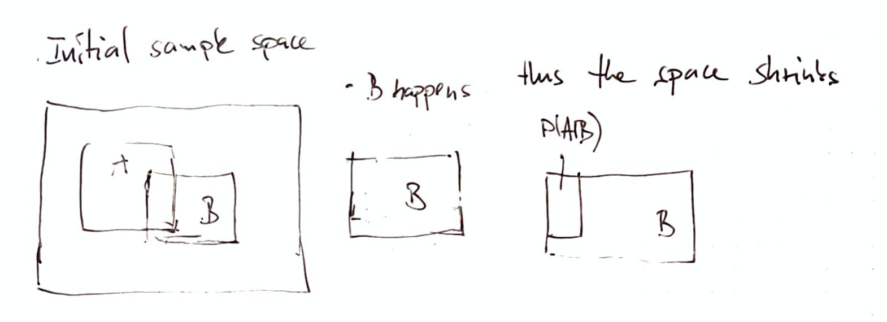

# Bayes rule

To derive the bayes rule first we start with joint and conditional distribution.

$p(A|B)$ is the probability that event A will happen given that we know that B has happended.

$$
p(A|B) = \frac{p(A,B)}{p(B)} 
$$

* $P(A,B)$ this tells us the probability that booth A and B have happend.
* $p(B)$ is a normalization constant. (But it has happend)

Now we can express this the other way:

$$P(B|A) = \frac{p(B,A)}{p(A)}$$

The joint distribution is simetric:

$$
p(A,B) = p(B,A)
$$

Now we can rearange the terms:

$$
p(A,B) = p(B,A) \\
p(A|B)p(B) = p(B|A)p(A) \\
p(A|B) = \frac{p(B|A)p(A)}{p(B)}
$$

And we have drived the bayes rule.