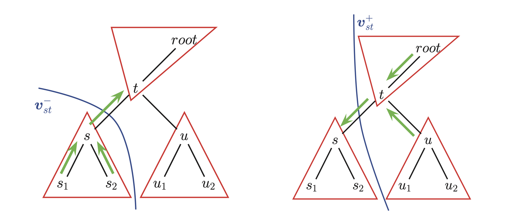

# Belief propagation for trees

It is generalization of the [forwards-backwards](infference_in_hidden_markov_models.md)) algorithm from chains to trees (it is also known as the **sum-product algorithm**)

## Serial protocol

Let assume a pairwise [MRF](markov_random_fields.md):

$$
p(x|v) = \frac{1}{Z(v)}\prod_{s \in V}\psi_x(x_s) \prod_{(x,t) \in \mathcal{E}} \psi_{s,t} (x_s, x_t)
$$

* $\psi_s$ is the local evidence of node s
* $\psi_{st}$ is the potential for edge $s - t$. 

We can implement BP for undirected trees as follows:

1. Pick an arbitrary ndoe and call it the root r.
2. Orient all the edges away from r ("pick up the graph" and let all the edges "dangle down" ) this gives a notion of parents and children. 
3. Send messages from leaves to the root (**collect evidence** phase)
4. Send messages back down from the root (**distribute evidence** phase) 

First picture is the collect evidence phase, the second the distribute evidence phase.

## Forward pass
We want to compute the belief state at node t. We initially condition the belief only on evidence that is at or below $t$ in the graf:

$$\text{bel}_t^-(x_t) = p(x_t|v_t^-)$$

This a "bottom-up belief state". We compute the "messages" from t's children, about what $t$ should know about the evidence $t$ children subtrees.

$$
\text{bel}_t^{-1} = p(x_t|v_t^{-1}) = \frac{1}{\psi_t}(x_t) = \prod_{c \in ch(t)} m_{c \rightarrow t}^-(x_t)
$$

* $m_{s\rightarrow t}^- (x_t) = p(x_t| v_{st}^-)$ where $v_{st}^-$ is all the evidence on the downstream side of the edge $s-t$

Now we can compute the bottom-up belief state at t as:

* $w_t(x_t) \propto p(x_t|v_t)$ is the local evidence for node t
* $Z_t$ is the local normalization constant

He we just multiply all the incoming messages from our children and well as the incoming messages from our local evidence, and then normalize.

### Compute the messages
$$m_{s \rightarrow t}(x_t)​$$ 

* s is one of t's children

$$\text{bel}_s^{-} (x_s) = p(x_s| v_s^-)​$$ 

We can compute the message as:

$$
m_{s \rightarrow t}^- (x_t) = \sum_{st}(x_s, x_t) \text{bel}_s^{-1}(x_s)
$$

> W convert belief about $x_s​$ about belief about $x_t​$ by using the edge potential $\psi_{st}​$. 

We continue this way up the tree, until we reach the root. Once at the root, we have seen all the evidence in the tree, so we can compute our local belief state at the root:

$$
\text{bel}_r(x_r) = p(x_r|v) = p(x_t| v_r^{-1}) \propto \psi_r(x_r)\prod_{c \in \text{ch}(r)} m^-_{c \rightarrow r}(x_r)
$$

This completes the upwards pass, which is analogous to the forwards pass in an HMM. 

We can compute the probability of the evidence by collecting the normalization constants:

$$
p(v) = \prod_tZ_t
$$

## Downward pass

To compute the belief state for s, we need to combine the bottom-up belief for $s$ with a top-down message from t. This summarizes all the information in the rest of the graph:

$$m_{t \rightarrow s}^+ (x_s) \triangleq p(x_t| v^+_{st})$$

* $v_{st}^+$ is all the evidence on the upstream side of the $s-t$ edge

**Belief state for s**

$$
\text{bel}_s(x_s) = p(x_s|v) \propto \text{bel}_s^-(x_s) \prod_{t \in \text{pa}(s)} m_{t \rightarrow s}^+ (x_t)
$$

In the downward message $m_{t \rightarrow s}^+$ we want to include the information that t has received, except for the information that s sent:

$$
m_{t \rightarrow s}^+ (x_s) = p(x_s| v_{st}^+) = \sum_{x_t} \psi_{st}(x_s, x_t) \frac{\text{bel}_t(x_t)}{m_{s \rightarrow t^-(x_t)}}
$$

We plug in $bel_t$:

$$
m_{t \rightarrow s}^+ (x_s) = \sum_{x_t}\psi_{st}(x_s, x_t)\psi_t(x_t) \prod_{c \in \text{ch}(t), c \ne s}m_{c \rightarrow t}^-(x_t)\prod_{p \in \text{pa}(t)} m_{p \rightarrow t}^+ (x_t)
$$

Here we multiply together all the mesages coming into $t$ from all nodes except for the recipient $s$, combine together and then pass through the edge potential $\psi_{st}​$. 

The version of BP in which we use division is called **belief updating**, and the version in which we multiply all-but-one of the messages is called **sum-product**.

## Parallel protocol

Unfortunately serial protocol cannot handle graphs with loops, hence wee need to consider a prallel version of BF, wich gives equivalent resutls to the serial version but is less efficient. 

The main idea is that all nodes recceive messages from their neighbors in parallel, they then update their belif states, and finally they send new messages back out to their neighbours. 
