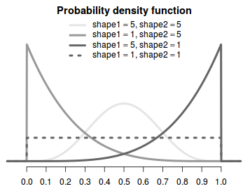

# Beta distribution
It can be viewed as a generalization of a Uniform distribution over the interval $[0,1]$ where the pdf is non constant. 

$$\theta \sim Beta(\alpha, \beta)​$$

Describes the probability of success in a binomial trial, and it is defined in the range $<0,1>$. This makes it ideal for modeling proportions and percentages. 

We recover the [uniform distribution](uniform_distribution.md) on [0,1] by:
$$
Unif(0,1) = Beta(1,1)
$$

# PDF
$$p(\theta|\alpha, \beta) = \frac{1}{B(\alpha,\beta)}\theta^{\alpha - 1}(1-\theta)^{\beta - 1} $$
* $0 \le \theta \le 1$
* $\alpha$ - is the **shape parameter** and it measures the number of successes in an binomial trial $\alpha -1$ 
* $\beta$ - is the **shape parameter** and it measures the number of failures in an binomial trial $\beta -1$ 
* $B(\alpha,\beta)$ is the [beta function](./beta_function.md) and it is an normalization constant

1. If $a < 1$ and $b < 1$then the PDF is U shaped and opens upward
2. If $a > 1$ and $b > 1$ then the PDF is U shaped and opens down.
3. If $a = b$, then the PDF is symmetric about $1/2$ 
4. If $a > b$ then the PDF favors values larger than $1/2$
5. If $a < b$ then the PDF favors smaller than $1/2$

## Constructing an beta from its mean and sd

$$ \alpha +b = \frac{E[\theta] ( 1 - E[\theta])}{var[\theta] - 1} ​$$

# Moments

## Mean

$$E[\theta] = \frac{\alpha}{\alpha + \beta} $$

## Variance

$$var[\theta]= \frac{\alpha \beta}{ (\alpha + \beta)^2 (\alpha + \beta + 1)}$$

## Mode
$$
\frac{a - 1}{a+b - 2}
$$

# Conjugacy
It the conjugate prior for:
* Binomial
* Bernoulli
* Geometric

# Properties
* $\alpha = \beta$  the distribution is symmetric about $\theta$
* $\alpha = \beta = 1$ the distribution is uniform $\alpha = 0, \beta =1$
* Variance is inversely proportional to the total $\alpha + \beta$ (the total number of trials)