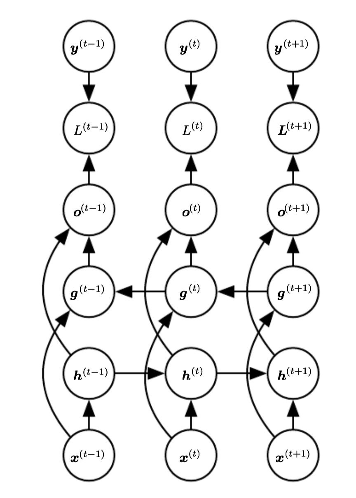

# Bidirectional Recurrent neural networks

It is a combination of two [recurrent neural networks](recurrent_neural_networks.md). The fist goes from the beginning to the end of the sequence. The second starts et the end and goes to the beginning of the sequence.

In this case if we predict $y^{(t)}$ than this prediction is based on the whole sequence. This architecture is common in translation. 