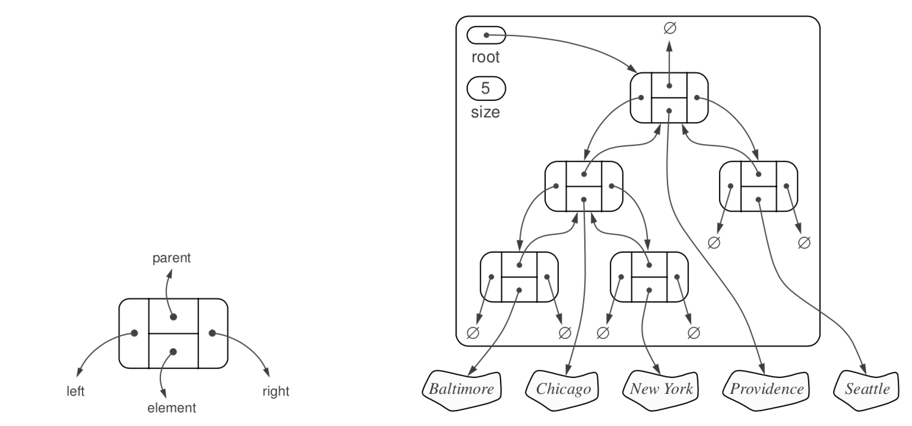
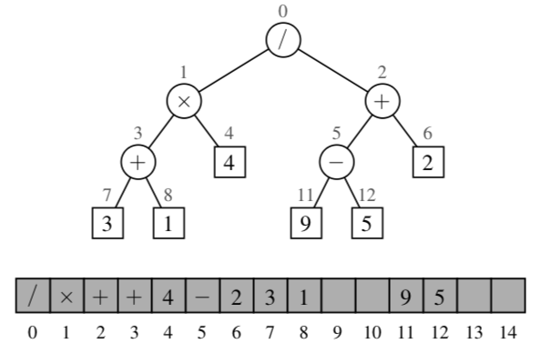

# Binary Tree

Binary [tree](trees.md) is an ordered tree with the following properties:

1. Every node has at most two children
2. Each child node is labeled as being either a left child or a right child
3. A left child precedes a right child in the order of children of a node 

Examples:
1. Answers to Yes-or-No questions (Decision tree).
2. An arithmetic expression can be parsed in this way. 

We say a binary tree is proper if each node, except leaf nodes, has exactly 2 children. An nonempty proper binary three with $n_E$ external nodes and $n_I$ internal nodes holds $n_E = n_i + 1$ (we can view the external node as a leaf).

## Linked Structure for Binary Trees

In an linked structure each node stores an reference to its parent, to his left and right child and the element it contains. If a node does not have any children then the left and right references are None. Each tree contains the root element of the tree and also its size. 

## Array-Based Representation of Binary Trees:
We an number the positions of a binary tree T the following way:

* If p is the root of T, then $f(p) = 0$
* If p is the left child of position q, then $f(p) = 2f(q) + 1$
* If p is the right child of position q, then $f(p) = 2f(q) + 2$

Here the function $f$ is known as a *level numbering* of the positions in a binary tree T. 

One advantage of an array-based representation of a binary tree is that a position p can be represented by a the single integer $f(p)$ and position methods like root , parent, left, right can be implemented using simple arithmetic operations on the number f(p).

Here deletions are expensive we may copy a lot of nodes $O(n)$

## Traversal
Here we look at possible ways we can [traverse](tree_traversals.md) a binary tree.