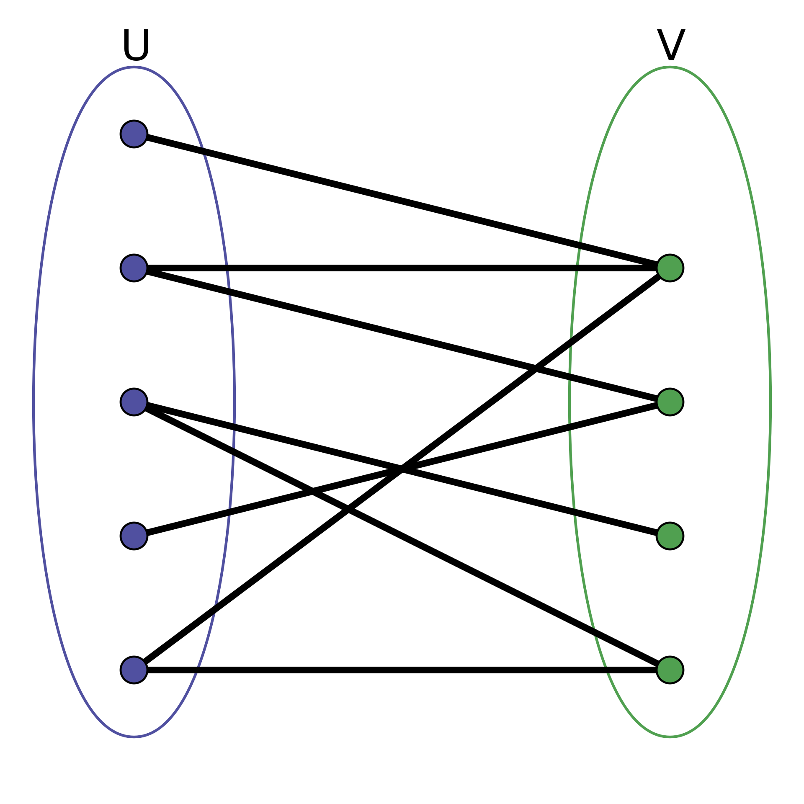

# Biparite graph

Is a graph whose vertices can be divided into two disjoint and independent sets $U,V$ such that every edge connects a vertex in U to one in V. Vertex sets U and V are usually called the parts of the graph.

