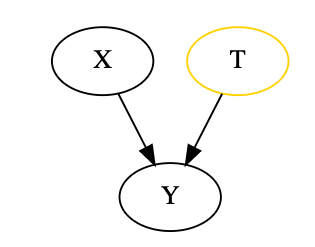
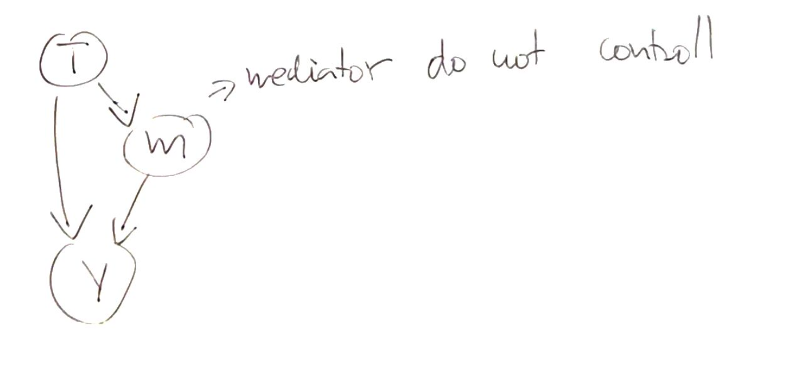
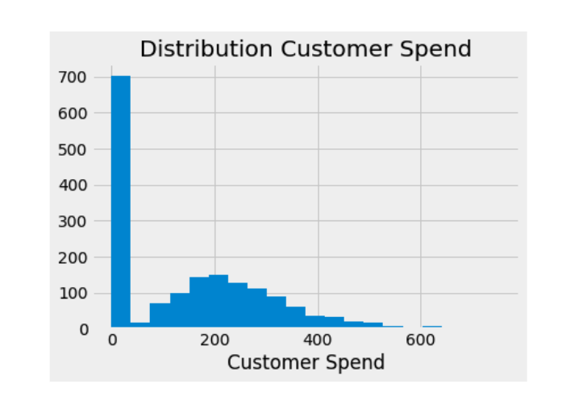
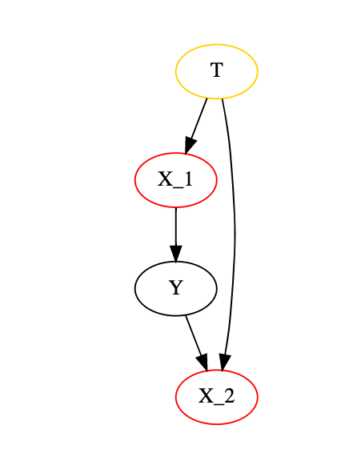

# Beyond Confounders

* there are some variables that are harmful to control on
* we should include variables that help reduce variability, iv a variable is a good predictor of the outcome, it will explain away a lot of its variance even if it is not a confounder
  
  
  
  * X is a good predictor thus we include it in our model

## Harmuful controls
* any predictor that is good at predicting the treatment but not the outcome

## Bad controls (Selection Bias)
* mediators, variables that are caused by the treatment, and have a direct path to the common effect

## Bad COP (Conditional on postives)
  
### Example:
* we have a gamma with a lot of zeros
  
* we split this into two parts, those who are zero and those $Y > 0$
* we want to measure the treatment on $Y>0$ 

$$
E[Y_i|T_i] = E[Y_i|Y_i > 0]p(Y_i> 0|T_i)
$$
* this conditional on positives is biased even if we have a random assignenment
  * prior the treatment some units are zero because they did not receive treatment, thus treatment causes them to be nonzero
  * some units however are never zero, treatment may increase their outcome, but even without treatment they will be non zero
  * these two groups are not comparable

* if we keep only never zeros, in booth treatment and controll and keep only zero -> nonzero flipper in the treatment, this makes the treatment and control no longer comparable, sionce control only contains those who are never zero, and the treatment contains booth types

$$
E[Y_i|T_i=1] - E[Y_i|T_i =0] \\
= E[Y_i|Y_i > 0, T_i=1]p(Y_i > 0|T_i = 1) - E[Y_i|Y_i > 0, T_i = 0] p(Y_i > 0|T_i = 0) \\ 
= \{ p(Y_i > 0|T_i = 1) - p(Y_i>0|T_i=0) \} \times E[Y_i|Y_i > 0, T_i = 1]  + \\
+ \{ E[Y_i|Y_i > 0, T_i =1] - E[Y_i|Y_i > 0, T_i=0]\} \times P(Y_i>0|T_i)
$$
* $p(Y_i > 0|T_i = 1) - p(Y_i>0|T_i=0)$ is the participation effect
* $E[Y_i|Y_i > 0, T_i =1] - E[Y_i|Y_i > 0, T_i=0]$ COP Effect

* the difference in averages is composed of:
  1. The differende of probability the outcome is positive (participation effect), it measures the increase in probability that a unit will participate
  2. Difference in outcome conditioned on partiticpation (COP Effect)
      * We can break down the COP effect to:
        $$
        E[Y_i|Y_i > 0 , T_i = 1] - E[Y_i|Y_i > 0 , T_i=0] = E[Y_{i1}|Y_{i1}] - E[Y_{i0}| Y_{i0} > 0 ] \\
        = E[Y_{i1} - Y_{i0}| Y_{i1} > 0] + \{ E[Y_{i0}| Y_{i1} > 0] - E[Y_{i0}| Y_{i0} > 0]\}
        $$  
        * $E[Y_{i1} - Y_{i0}| Y_{i1} > 0]$ is the causal effect
        * $\{ E[Y_{i0}| Y_{i1} > 0] - E[Y_{i0}| Y_{i0} > 0]\}$ is the selection bias

* we can visualize COOP as:

