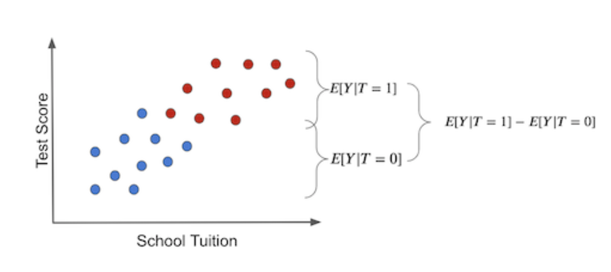
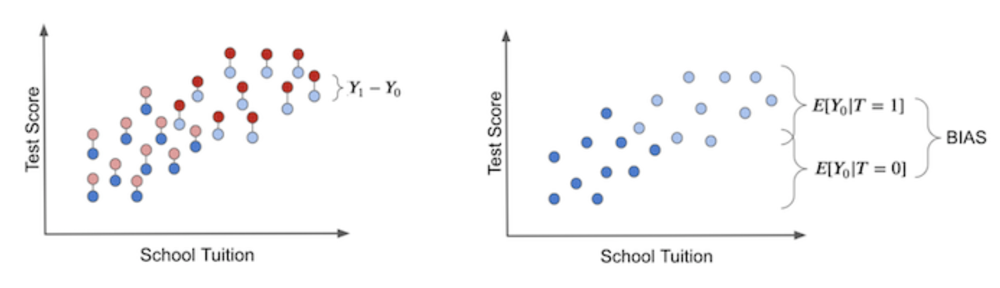
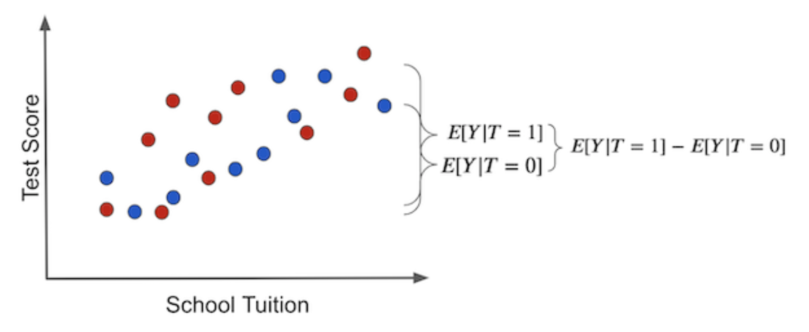
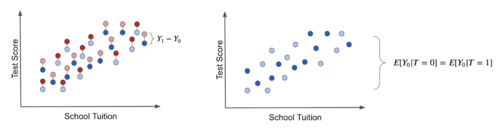

# Causality
* the main idea of causal inference is to transform association into causation
* counterfactuals (inverse causal), "what if" question 
  * examples
    * what if we change the price
    * what if we change the diet

## Basic notation

$$
T_i \begin{cases}
    1 \space \text{ if unit i has received treatment} \\
    0 \space \text{ otherwise}
\end{cases}
$$

$Y_i$ observed outcome for unit $i$, a we are interested in the treatment had any effect

* **fundamental problem** with causal inference is that we never observe the same unit with and without treatment

### Potential outcome
* we are interested in the potential outcomes, if the potential outcome has happened we call it factual, if it did not happen we call it counterfactual
  
* $Y_{0i}, Y_i(0)$ is the potential outcome for unit i without treatment
* $Y_{1i}, Y_i(1)$ is the potential outcome for unit i with treatment

**Potential outcome** for a treatment is defined as:

$$
Y_{1i} - Y_{0i}
$$
* this is never observed, since we observe only one outcome 

## Average treatment effect
* instead of estimating individual treatment effects we estimate the average treatment effect

    $$
    ATE = E[Y_1 - Y_0]
    $$

* is the average treatment effect of the treated

    $$
    ATET = [Y_1 - Y_0|T=1]
    $$

## Bias
* makes association different from causation

  * association 

    $$
    E[Y|T=1] - E[Y|T=0]
    $$

  * Causation
    $$
    E[Y_1 - Y_0]
    $$

* to relate causation to association we replace observed outcomes with potential outcomes. For the treated, the observed outcome is $Y_1$. For the untreated, the observed outcome is $Y_0$.
    $$
    E[Y|T=1] - E[Y|T=0] = E[Y_1|T=1] - E[Y_0|T=0]
    $$
* we add counter factual outcome (if the treatment would receive treatment)
    $$
    E[Y|T=1] - E[Y|T=0] = E[Y_1|T=1] - E[Y_0|T=0] + E[Y_0|T=1] - E[Y_0|T=1]
    $$
* reorder an merge observations 
    $$
    E[Y|T=1] - E[Y|T=0] = E[Y_1 - Y_0|T=1] + E[Y_0|T=1] - E[Y_0|T=0]
    $$
    * $E[Y_0|T=1] - E[Y_0|T=0]$ is the bias term
  * this equations tells us why association is not causation
  * association can be decomposed as:
    * treatment effect of the treated
    * bias, which is how the treatment and control groups differs before treatment
* we can transform association into causation if
    $$
    E[Y_0|T=0] = E[Y_0|T=1]
    $$
  * this means that the treatment and control groups are comparable before treatment

* since the bias cancels we get
    $$
    E[Y|T=1] - E[Y|T=0] = E[Y_1 - Y_0|Y=1] = ATET
    $$
* we can say that the causal impact of the treated is the same as the untreated (since they are similar)

$$
E[Y_1 - Y_0|T=1] - E[Y_1|T=1] - E[Y_0|T=1] \\
= E[Y_1|T=1] - E[Y_0|T=0] \\
= E[Y|T=1] - E[Y|T=0]
$$

* since the treated and untreated are exchangeable  $E[Y_1 - Y_0|T=1] = E[Y_1 -Y_0|T=0]$ than the difference in means become the causal effect

$$E[Y|T=1]-E[Y|T=0] = ATET = ATE$$

* the difference may be due
  * treatment effect
  * other difference

* if we could observe counter factuals
  

* the light dots are counterfactuals
* we get bias if we set everyone NOT to receive the treatment 
  * we left only with potential outcome, and we see how the treated differs from the untreated, if there is a difference we know tht there is something other than the treatment that makes the difference (There is bias between groups)

* if we look ath the situation where is no bias
 

  * the difference in outcomes is the average causal effect, (there is no other source of difference)  

    

  * if we set nobody to receive treatment, we observe $Y_0$, we find no difference between the groups

* the main idea of causal inference is to remove bias making the treated and untreated comparable