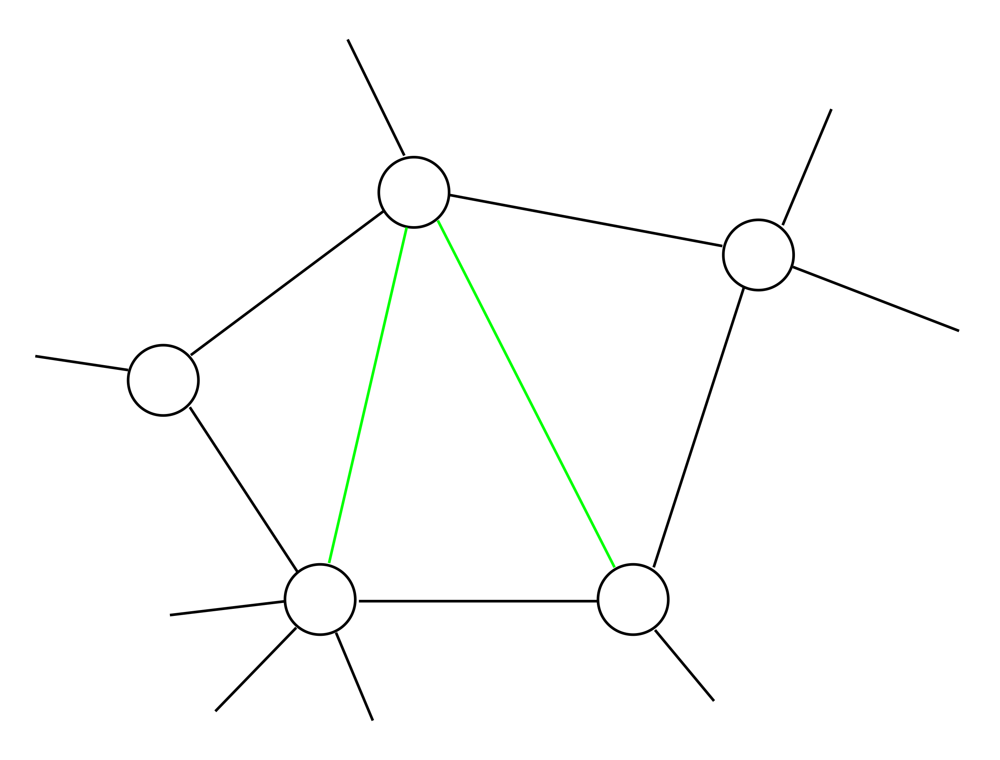

# Chordal graph

Every undirected cycle $X_1 - X_2 \cdots X_k - X_1$ of length $k \ge 4$ has a *chord*. 

Chord is an edge that is not part of the cycle but connects two vertices of the cycle

Example of a chord. The green edges are not part of a cycle.