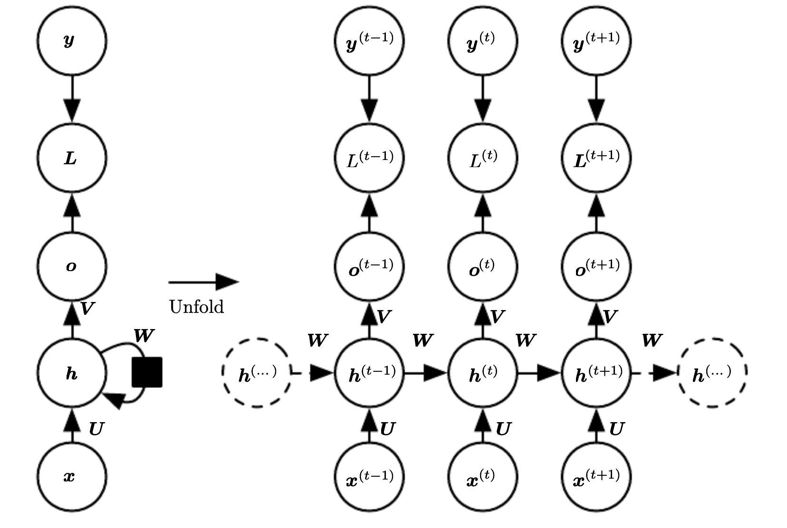
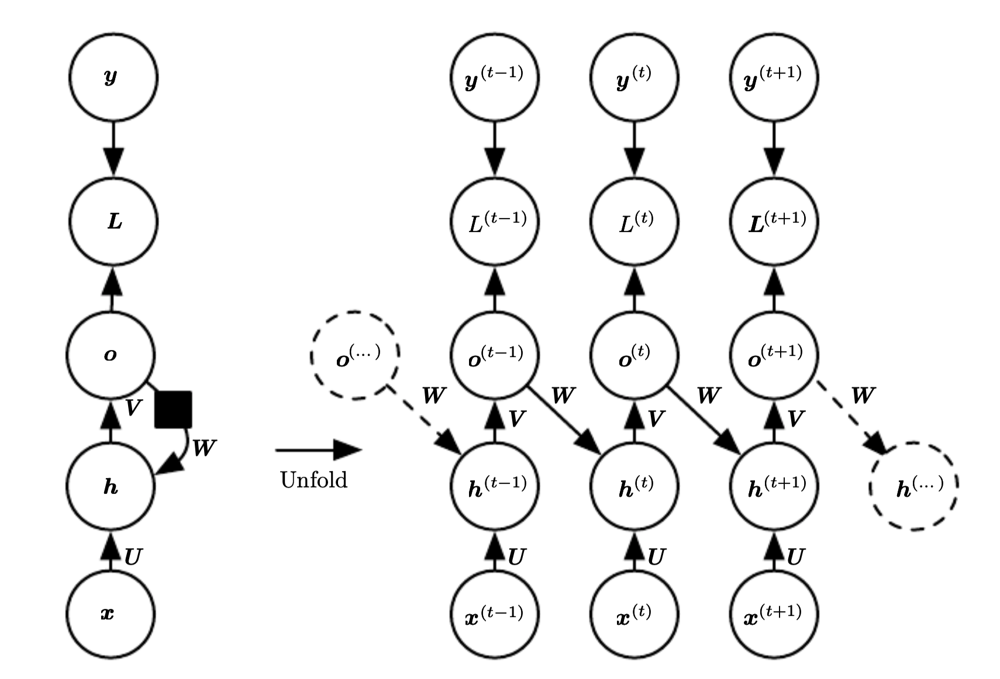
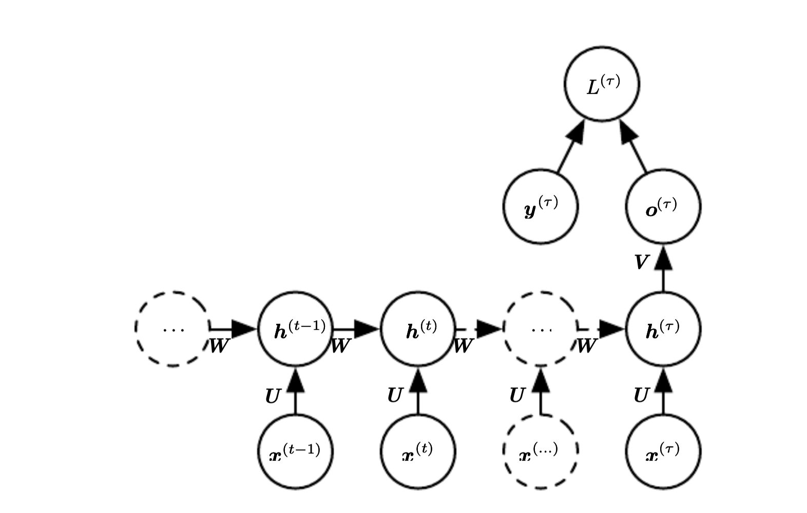

# Common recurrent neural network architectures
There are multiple ways to define a [recurrent neural network](recurrent_neural_networks.md).

## RNN with Recurrent connection between hidden units producing output every time step.

This is an universal network, which means it can compute any function that a touring machine can with a finite state.

$$
a^{(t)} = b = Wh^{(t-1)} + Ux^{(t)} \\
h^{(y)} = \tanh(a^{(t)}) \\
o^{(t)} = c + Vh^{(t)} \\
\tilde{y}^{(t)} = \text{softmax}(o^{(t)})
$$

This maps an input sequence to a output sequence of the same length. The total loss for a sequence is the sum of losses over all the time steps. The gradient computation involves performing an forward propagation pass moving left to right on the unfolded graph, followed by backward pass right to left on the unfolded graph. 

The runtime cost is $O(\tau)$ and cannot be parallelized since the operations are sequential. The space cost is also $O(\tau)$ since we need to keep intermediate values during the backward pass. The algorithm to perform back-propagation is called [back-propagation trough time](backpropagation_trough_time.md)

## RNN with recurrent connection between output and hidden units producing output every time step.

We propagate only the output to the next hidden state. Thus the hidden states are connected only by their predictions.  This network is less powerful than the one that has a recurrent connection between hidden states, but it is cheaper to train.

## RNN producing a single outcome after reading the whole sequence

This is used to summarize an entire sequence and produce a fixed representation for future processing.

