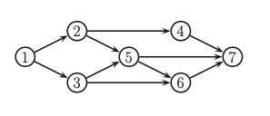

# Conditional independence

The most important part of graphical models is the conditional independence assumption.

$$X_A \perp_G X_B  | X_C$$

Hence A is independent of B given C in the graph G and is defined as:

Let $I(G)$ be a set of all such CI statements encoded by the graph. We say that $G$ is an **I-map** (Independence map) for $p$, or that $p$ is **Markov** wrt $G$, iff $I(G) \subseteq I(p)$ where $I(p)$ is the set of all CI statements that hold for distribution $p$, in other words, the graph is an I-map if it does not make any assertions of CI that are not true of the distribution. This allows a graph to model CI.

In case that a graph is fully connected, it is an I-map of all distributions since it does not make any CI assumptions. Hence we can say that $G$ is a **minimal I-map** of $p$ if $G$ is an I-map of $p$, and if there is no $G' \subseteq G$ which is an I-map of p.

## [D-Separation](d-separation.md)
Allows to reason about CI in graphs. From this we can derive other rules:

> Clarify some notation
> 
> $\{1,2,3\} \backslash  \{1,3\} = \{2\}$$
### Directed local Markov property

$$t \perp nd(t) \space \backslash \space pa(t) | pa(t) $$

* nd(t) are the non descendants of a node ($nd(t) = V \space \backslash \space \{ t \cup desc(t) \}$)

This equation is also known as the **directed local Markov property**.

Example:

> 
> 
> $nd(3) = \{2,4 \}$ and $pa(3) = 1$ hence $3 \perp 2,4 | 1$

### Ordered markov property

$$t \perp pred(t) \space \backslash \space pa(t)  | pa(t)$$

> 
>
> $pred(3) = \{1,2 \}$ and $pa(3) = 1$ then $3 \perp 2 | 1$

## Markov blanket and full conditionals

**Markov blanket** $mb(t)$ of a node t is the set of  of nodes that renders the node t conditionally indpendent of the other nodes in the graph. 

Markov blanked of a node in a DGM is equal to the parents, children and **co-parents** (nodes who are also parents of its children)

$$mb(t) \triangleq ch(t) \cup ca(t) \cup copa(t)$$

>
>
>$mb(5) = \{ 6,7\} \cup \{ 2,3\} \cup \{4\}$

To see why the co-parents are in the Markov blanked we can derive

$$ p(x_t| x_{-t}) = p(x_t, x_{-t}) / p(x_{-t}) $$ 

All the terms that od not involve $x_t$ will cancel out between numerator and denominator, so we are left with a product of CPDs which contain $x_t$ in their scope:

$$p(x|x_{-t}) \propto p(x_t| x_{pa(t)}) \prod_{x\in ch(t)} p(x_s| x_{pa(s)})$$

Example:

>
>
> $p(x_5 | x_{-5}) \propto p(x_5| x_2, x_3)p(x_6|x_3,x_5)p(x_7|x_4, x_5,x_6)$

This result is called t's **full conditional distribution**