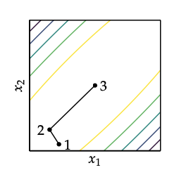

# Conjugate gradient
[Gradient descent](gradient_descent.md) can perform poorly in narow vallyes. Conjugate gradient method overcomes this by borrowing inspiration from methods that optimize quadratic function:

$$ \min_x f(x) = \frac{1}{2}x^TAx + b^Tx + c $$

* $A$ is symmetric and positive definite thus $f$ as a unique global minimum.

Conjugate gradient can optimize n-dimensional quadratic functions in n steps. 

Its directions are mutually conjugate with respect to A.

$$ d_i^TAd_j = 0; \;\; \text{ for } i \ne j $$

Mutually conjugate vectors are the basis vectors of A. They are generally not orthogonal to one other.

The successive conjugate  directions are computed using gradient information and the previous descent direction. The algorithm starts with direction of the steepest descent: 
$$
d^1 = -g
$$
We use line search to find the next design point. For quadratic functions the step $\alpha$ can be computed analytically. $\alpha = \frac{d^T(Ax+b)}{d^TAd}$. 

The update than becomes:

$$
x^2 \leftarrow x^{1} + \alpha^{1} d^{1}
$$

The next iterations are based on the next gradient and the contribution from the current descent direction:

$$
d^{(k+1)} = -g^{(k+1)} + \beta^{(k)} d^{(k)}
$$

* $\beta$ is a scalar parameter. If its large than the previous descent direction contributes more strongly. 

We can derive the best value for $\beta$ for a known $A$, using the fact that $d^{(k+1)}$ is conjugate to $d^k$

$$
d^{(k+1)T} Ad^{(k)} = 0 \\
\Rightarrow (-g^{(k+1)} + \beta^{(k)}d^{(k)})^T Ad^{(k)} = 0 \\
\Rightarrow -g^{(k+1)^T}Ad^{(k)} + \beta^{(k)}d^{(k)T}Ad^{(k)} = 0 \\
\Rightarrow \beta^{(k)} = \frac{g^{(k+1)^T} Ad^{(k)}}{d^{(k)T}Ad^{(k)}}
$$

We can apply Conjugate gradient to non quadratic functions. Smooth continuous functions behave like quadratic if we are close to a local minimum. 

In general we do not know $A$ that best approximates $f$ arround $x^k$. Thus there are several choices for $\beta^{k}$ that work well:

## Fletcher-Reeves:
$$
\beta^{(k)} = \frac{g^{(k)T}g^{(k)}}{g^{(k-1)T}g^{(k-1)}}
$$

## Polak-Ribiere
$$
\beta^{(k)} = \frac{g^{(k)T}(g^{(k)} - g^{(k-1)})}{g^{(k-1)T}g^{(k-1)}}
$$

It is not guaranteed to converge unless we modify it for automatic rests $\beta \leftarrow \max(\beta, 0)$.

## Algorithm
Here we use Polak Ribiere:

Initialize
$$
g = \nabla f(x) \\
d  = -g
$$

Iterate:
$$
g' = \nabla f(x) \\
\beta = \max(0, \Big( \frac{g' \cdot (g' - g)}{g \cdot g}\Big)) \\
d' = -g' + \beta d \\
x' = \text{line\_search}(f, x, d') \\
d = d', g = g' \\
\text{return } x'
$$
