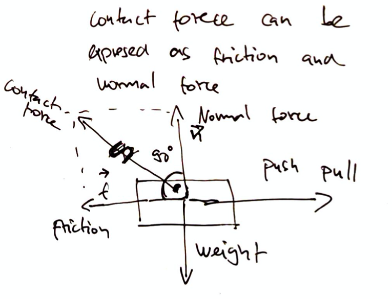

# Contact Force

Friction and normal force are contact forces. Here we describe what happens to objects if we apply force to them. 

We can decompose contact force into two parts
* normal force $\vec{n}$
* friction $\vec{f}$

We can divide friction into

* $f_k$ *kinetic friction*, associated with moving objects
* $f_s$ *static-friction*, associated with objects at rest 

If we push something in general we require more force to get it moving than to keep it moving.

## Kinetic friction
The magnitude of kinetic friction force $f_k$ usually increases when the magnitude of the normal force $n$ increases. (We need more force to move something heavy). Thus $f$ is approximately proportional to the magnitude of the normal force:

$$
f_k = \mu_k n
$$

* $\mu_k$ is the coefficient of kinetic friction

The kinetic coefficient is smaller for more slipper surface. This coefficient is only an approximation to events that happen on microscopic scale, booth normal and friction results from intermolecular forces in places of contact.

## Static friction

As we push/pull an object on a floor, it exerts equal opposite force, this force increases as we pull harder until we overwhelm it. 

The maximum static friction force that a surface excerpts is defined as $f_{s,max}$. Similarly to kinetic friction force, static friction is proportional to the magnitude of normal force. 

$$
f_s \le \mu_s n \\
f_{s,max} = \mu_s n
$$

* $\mu_s$ is the coefficient of static friction