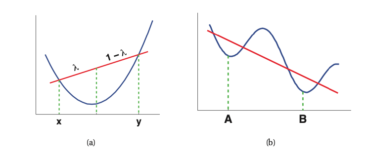

# Convex Functions

A function $f$ is convex if for any two points the following inequality holds:

$$f(tx + (1-t)x) \le tf(x) + (1-t)f(y)$$ 
* $x \ne y$
* $0 < t < 1$
  

a) is convex, b) is not
## Epigraf
A function is convex if its [epigraph](epigraf_of_a_function.md) defines a convex set.

## Convex sets

If a functions $f$ is defined on a [convex set $S$](convex_set.md)  and for any $\theta, \theta' \in S$  and $0 \le \lambda \le 1$ we have

$$ f(\lambda \theta + (1- \lambda)\theta') \le \lambda f(\theta) + (1- \lambda)f(\theta') $$

# Strict convexity
Same as convex but with strickt inequality. 

$$f(tx + (1-t)x) < tf(x) + (1-t)f(y)$$ 

This means that f is convex and has greater curvature than a linear function. 

## Strong convexity

We say that a function $f$ is strongly convex when for a paramter $m > 0$

$$g(x) = f(x) - \frac{m}{2} ||x||_2^2$$

If $g$ is a convex function. This means that f is at least as convex as a quadratic function. 

## Convex relationship
strongly conves => strictly convex => convex

# Operations that preserve convexity
**Nonnegative linear combinations of convex functions**

$f_1a_1 + \cdots + f_na_n$
* $a_1, \cdots, a_n \ge 0$

**Point wise maximization of a convex function**

If $f_s$ is convex than for any $s \in S$ point wise maximization $f(x) = \max_{s\in S}f_s(x)$ yields an convex function. 

**Partial minimization**

If $g(x,y)$ is convex in x, y and C is convex then $f(x) = min_{g \in C}g(x,y)$ is convex.

We can minimize over some variables if g is convex and x and y are from an convex Set.

# Convexity in higher dimesnions

We can expand the notion of convexity to multiple dimensions, than a convex function has to have a bowl shape, that means it will have a unique global minimum $\theta^*$ corresponding to the bottom of the bowl. This means that the second derivative must be positive everywhere:

$$\frac{d^2}{d^2 \theta^2} f(\theta) > 0$$ 

A twice differentiable, mutivariable function is convex if its [Hessian](hessian.md) is positive definite for all $\theta$. 
