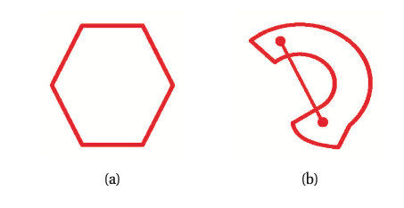

# Convex set
A set $S$ is convex if for any $\theta, \theta' \in S$ 

$$\lambda \theta + (1- \lambda)\theta' \in S, \forall \lambda \in [0,1]$$

In human language we can take any 2 points in a convex set, and if we connect them with a line, than the line will be inside the set. 

a) is a convex set

b) is not a convex set