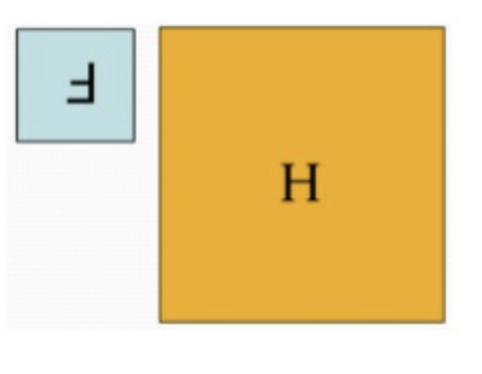

# Cross correlation

There is a close relationship between cross correlation and [convolution](convolution_operation.md).

The convolution operator fo a 2D image H and a 2D kernel F is defined as:

$$
G = H * F \\
G[i,j]= \sum_{u=-k}^k \sum_{v=-k}^k H[u,v]F[i-u, j-v]
$$

The cross correlation is defined as:

$$
G = H \bigotimes F \\
G[i,j]= \sum_{u=-k}^k \sum_{v=-k}^k H[u,v]F[i+u, j+v]
$$

The difference between them is that:

* convolution is equivalent to flipping the filter in booth dimensions (bottom to top, right to left) and apply cross correlation.
* if the kernel is symmetric the result is the same
* in general most ml library use cross correlation and call it convolution.

