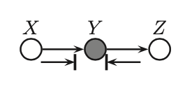
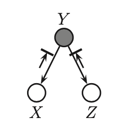
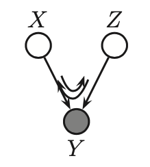

# D-separation (Directed-Separation)

If we have 3 nodes A, B and C. Given the following structures we can derive independence assumptions

* Common Parrent. Here $A \leftarrow B \rightarrow C$ if we observer B then $A \perp C | B$. If B contains all the information that determines the outcomes of A and C, than once we observe it there is nothing that affects these variable's outcomes. 
* Cascade. Here if we observe B, than $A \perp C | B$.  $A \rightarrow B \rightarrow C$ The inituition is that if B holds all the information that determines C, thus it does not matter what value A takes.
* V-Structure $A \rightarrow C \leftarrow A$. Here knowing C couples A and B, thus $A \cancel{\perp} B | C$.

## Probability view
We can look at these in terms of probabilities to make more sense:

1. $X \rightarrow Y \rightarrow Z$

   Can be encoded as $p(x,y,z) = p(x)p(y|x)p(z|y)$ when we condition on y are x and z independent?

   $$
   p(x,z|y) = \frac{p(x)p(y|x)p(z|y)}{p(y)} = \frac{p(x,y)p(z|y)}{p(y)} = p(x|y)p(z|y) \Rightarrow x \perp z | y
   $$

2. $X \leftarrow Y \rightarrow Z$

   $p(x,y,z) = p(y)p(x|y)p(z|y)$ if we condition on y are x and z indepedent?

   $$
   p(x,z|y) = \frac{p(x,y,z)}{p(y)} = \frac{p(y)p(x|y)p(z|y)}{p(y)} = p(x|y)p(z|y) \Rightarrow x \perp z | y
   $$

3. $X \rightarrow Y \leftarrow Z$

   $p(x,y,z) = p(x)p(z)p(y|x,z)$ if we condition on y are x and z indepenedent?

   $$p(x,z|y) = \frac{p(x)p(z)p(y|x,z)}{p(y)} \Rightarrow x \cancel{\perp} z| y$$

   However $p(x,z) = p(x)p(z)$, x and z are marginally independent. The condition on a common child at the bottom of a v-structure makes its parents become dependent. This effect is called **explaining away, inter-causal reasoning, Berkson's paradox**. 

   An example would be 2 coins flips, they are iid, but if we would condition on their sum sudenly it provides us information about those flips.

## Bayes Ball algorithm

We can visualize d-separation between $X,Y,Z$, by conditioning on $Y$ by shading it gray. If we bounce a ball from X or Z, where $Y$ bounce it away, we look if it can reach any other node. A ball however can travel in an opposite direction.

1. $X \rightarrow Y \rightarrow Z$
   

The ball bounces back.

1. $X \leftarrow Y \rightarrow Z$

The ball bounces back.

1. $X \rightarrow Y \leftarrow Z$

Here a ball bounces from X trough Y to Z. And vice versa. This makes intuitively sense, since X and Z are independent of each other. But if we know Y, that means that we can tell something about Z.