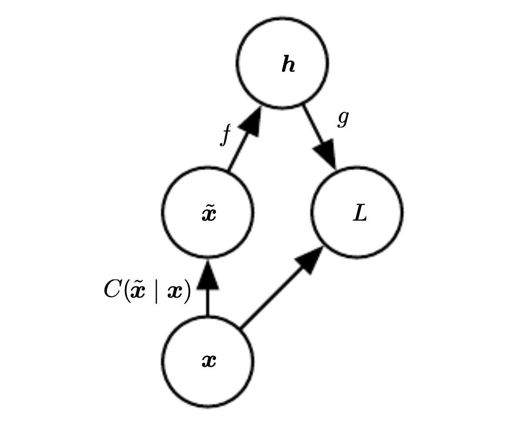

# Denoising [autoencoder](autoencoder.md) (DAE)

The objective is to minimize:

$$
L(x, g(f(\tilde{x})))
$$

* $\tilde{x}$ is x corrupted by noise, this forces to learn other than identity function

Thus we encoder receives an corrupted data point and the whole autoencoder tries to remove the corruption.

Our goal is to learn the following model:

$$
p_{\text{reconstruct}}(x|\tilde{x})
$$

If the encoder is deterministic than we can view it and train it as any feed-forward network.

## Estimating the score
* an alternative training procedure to [MLE](maximum_likelihood_learning.md).

* provides an consistent estimator of probability distribution based on encouraging the model to have the same score as the data distribution at every training point. 
* the score is a particular gradient field

$$
\nabla_x \log p(x)
$$

* if a autoencoder learns a gradient field $\log p_{\text{data}}$ it learns the structure of $p_{\text{data}}$ itself
* We can connect the to [RBM](restricted_boltzman_machine.md)