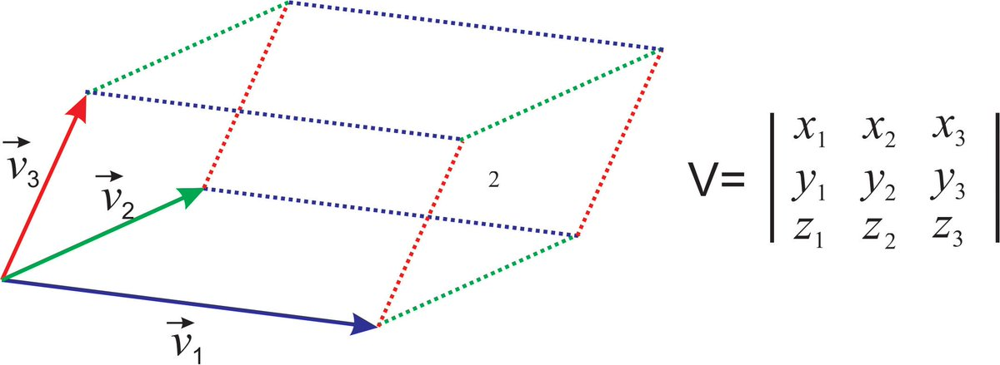
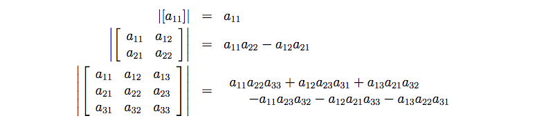

# Determinant
Is a function that maps a matrix to a scalar:

$$
\text{det}(A_{m\times n}) \rightarrow R \\ 
\text{det}(A) = \prod_{i=1}^n \lambda_i
$$

Thus the determinant is the product of the eigenvalues of a matrix.

The absolute value of the determinant can be viewed as how much multiplication by a matrix expands or contracts the space. If the determinant is zero than the space is completely contracted along at least one axis, causing it to loose all its volume. If the determinant is 1 than the volume is preserved.

Geometrically the absolute value of the determinant $|det A|$ can be viewed as the area (volume) of the parallelepiped.

## Determining the determinant

* perform matrix decomposition to find the upper triangular matrix, than the determinant is the product of the main diagonal (pivots)
* perform eigenvalue decomposition, the determinant is the product of the eigenvalues

### Adjoint matrix
Let 
$$ A \in R^{n \times n}, A_{\setminus j, \setminus i} \in R^{(n-1) \times (n - 1)} $$

be the matrix that results form deleting the ith row and jth column from A. 

Now we can get the determinant using the following recursive formula:

$$
|A| = \sum_i^n (-1)^{i + j} a_{ij} |A_{\setminus i, \setminus j}| \text{ for any } j \in 1,2, \cdots, n \\
|A| = \sum_j^n (-1)^{i + j} a_{ij} |A_{\setminus i, \setminus j}| \text{ for any } i \in 1,2, \cdots, n
$$

## [Rules of determinants ](rules_of_determinants.md)
As we modify a matrix we modify the determinant.