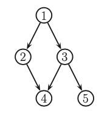
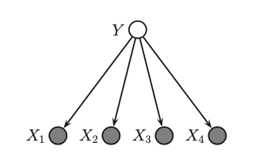
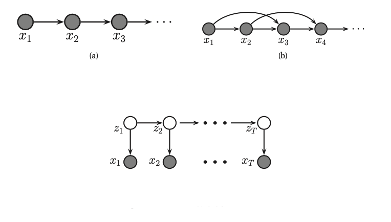

# Directed graphical models

Use directed graphs (DAG) to represent probability distributions.

Also known as 
* Bayesian network,
* Belief networks, they representation is subjective.
* Casual network, directed arrows model casual relationship

The key property of DAGs is that nodes can be ordered such that parents come before children. Given this ordering we define the **ordered markov property**, which assume that the children depend only on their parents, not on all the predecessors.

$$x_s \perp x_{preds(s) \ pa(s)} | x_{pa(s)} $$

* preds(s) are the predecessors of the node s
* pa(s) are the parents of node s

Now we can simplify the join distribution of the following graph

$$
p(x_{1:5}) = p(x_1)p(x_2|x_1)p(x_3| x_1, \cancel{x_2})p(x_4| \cancel{x_1}, x_2, x_3) p(x_5, \cancel{x_1}, \cancel{x_2}, x_3, \cancel{x_4}) \\ 
= p(x_1)p(x_2|x_1)p(x_3|x_1)p(x_4|x_2, x_3)p(x_5|x_3)
$$

## Formal definition

Bayesian Network is a directed graph $G = (V,E)$ together with:
* random variable $x_i$ for each node $i \in V$
* conditional probability distribution (CPD) $p(x_i| x_{pa(t)})$ per node, specifying the probability of $x_i$ conditioned on its parent's values. (this is often defined as [probability tables](probability_tables.md).)

It defines the following joint probability distribution.
$$p(x_{1:V}| G) = \prod_{t=1}^V p(x_i| x_{pa(t)})$$

This probability distribution $p$ defines an [I-map (independence map)](independence_map_of_g.md).

If each node has $O(F)$ parents and K states the number of parameters in the model is $O(VK^F)$, which is much less than the $O(K^V)$ needed by a model which makes no CI assumptions.

# Examples
## Naive Bayes
In naive bayes we assume that features are conditionally independent given the class label. 

$$p(y,x) = p(y) \prod_{j=1}^D p(x_j|y)$$

## Markov and hidden Markov Models

a) **First order Markov chain**, where the intermediate past $x_{t-1}$ caputres everything wee need to know about the future.

b) **Second order Markov chain** and it corresponds to the folowing conditional distribution:

$$p(x_1,x_2) =  \prod_{t=3}^T p(x_t| x_{t-1}, x_{t-2})$$

We can create higher order but then we need to have a lot of data.

c) [Hidden Markov model (HMM)](hidden_markov_models.md) we assume that there is some hidden process that results in noisy observations.

Here $z_t$ is known as **hidden variable** "at time t" and $x_t$ is the observed variable. And the CPD $p(z_t| z_{t-1})$ is the **transition model** and the CPD $p(x_t|z_t)$ is the **observation model.**

The hidden variables represent quantities of interest, and in general we want to estimate the hidden state given the data, i.e to compute $p(z_t|x_{1:t}, \theta)$. This process is called **state estimation**. 

## Learning

* [MLE estimation](mle_for_bayesian_networks.md)