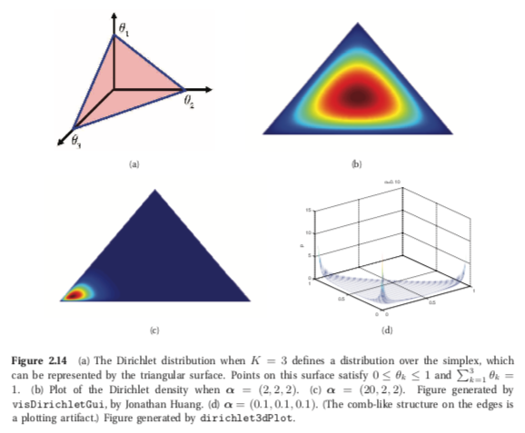

# Dirichlet distribution
It is a multivariate generalization of the Beta distribution, and it has support over the **probability simplex**

$$ S_K = \{x: 0 \le x_k \le 1, \sum_{k=1}^K x_k = 1 \}$$

(This can be viewed as distribution over probability distributions)

A random variable $X \sim Dir(\alpha)$ is said to have a Dirichlet distribution if its pdf is:

$$Dir(x| \alpha) \triangleq \frac{1}{B(\alpha)}\prod_{k=1}^K x_k^{\alpha k -1 } I(x \in S_K)$$

* $B(\alpha)$ is the generalization of the Beta function into K variables, $B(\alpha) \triangleq \frac{\prod_{k=1}^K \Gamma(\alpha_k)}{ \Gamma(\alpha_0)}$, here $\alpha_0 \triangleq \sum_{k =1}^K \alpha_k$

From the picture we can see that $\alpha_0 \triangleq \sum_{k =1}^K \alpha_k$ controls the strength of the distirbution (How peaked it is). Example:
* Dir(1,1,1) is a uniform distribution
* Dir(2,2,2) is a broad distribution centered at $(1/3, 1/3, 1/3)$
* Dir(20,20,20) is a narow distribution centered at $(1/3, 1/3, 1/3)$ 
* If $a_k < 1$ for all $a_k$ then we get spikes at the corrners of the distribution.

## From dirichlet to Beta

If we have a dirichlet distribution $Dirichlet(a_1, \cdots, a_n)$. We can compare 2 values using:

$Beta(a_1, a_2)$ hence we can decide to ingore the rest if we are interested only in two.

Hence this justifies the application of binomial distribution to multinomial problems when we are only interested in two of the categories.

