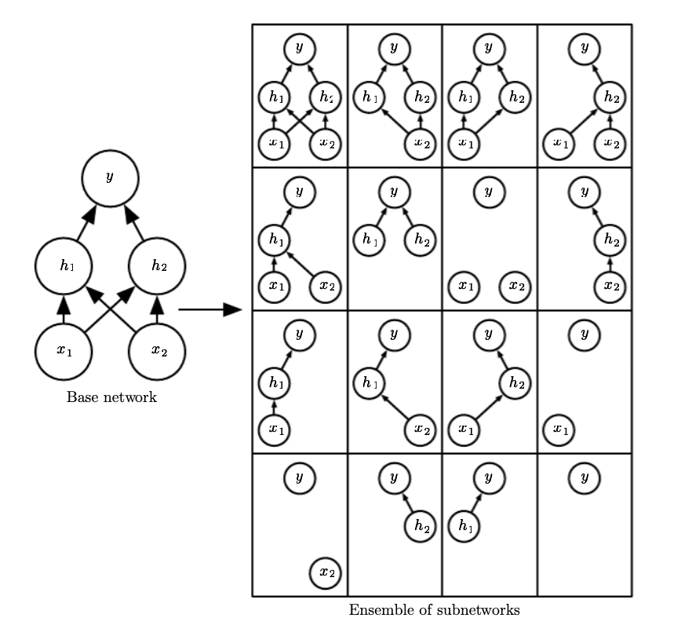

# Dropout
Approximates the training an evaluating an [bagged](boostrap_aggregation.md) assemble of exponentially many neural networks. Dropout train an ensemble consiting of all subnetworks that can be formed by removing nonoutput units form an underlying base network (sets the weights to zero.)

Each time we load an minibatch we sample a random bit max to apply to all input and hidden units. A mask for every unit is sampled independently, the probability of a sampling mask is set before training. 

The loss function with the bit max is :

$$
J(\theta, \mu)
$$

* $\mu$ is the bit mask vector

## Intuition
Dropout trains an ensemble of models that share hidden units, this means hidden units have to perform well regardless of which other unit is included in the model, this forces redundancy in the network.

## Predictions
To make predictions we have to evaluate:

$$
p(y|x) = \sum_{\mu}p(\mu) p(y|x, \mu)
$$
* $p(\mu)$ is the probability distribution used to sample $\mu$ at training time

This is intractable, in practice we have only 10-20 masks to achieve good performance.

## Weight scaling inference rule
On average the probability that a weight is included in the model is 1/2 thus it is common after training to multiply the weights by 2.

## Pros
* cheap $O(n)$ time and memory
* more effective than other inexpensive regularizers
* can be combined with other regularizers

## Cons
* limits the capacity of the model, and it can result in larger models