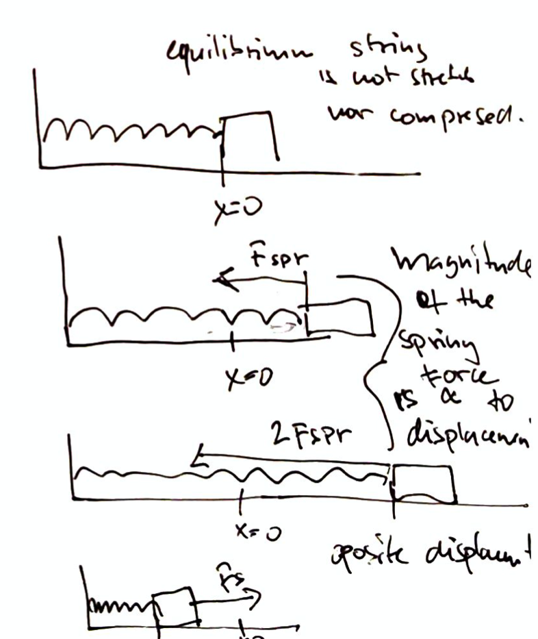

# Elastic Forces

If we expand or contract a spring under force it behaves in certain way.

We can describe this behavior using Hooke's law.

## Hooke's law
For springs, the spring force is approximately proportional to the distance x by which the spring is stretched or compressed.

$$
F_{\text{spr}} = -kx
$$

* $k \ge 0$ is a proportionality constant (force constant) 
  * its units are $N/m$
  * it is higher for stronger strings, and vice versa

