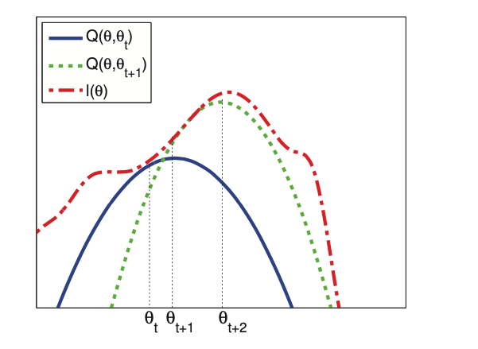

# EM Theory

[EM](em_algorithm.md) monotonically increases the observed data log likelihood until it reaches a local maximum (or saddle point, although such points are usually unstable).

## Expected complete data log likelihood is a lower bound

Consider an arbitrary distribution $q(z_i)$ over the hidden variables. The observed data log likelihood can be written as follows:

$$ l(\theta) \triangleq \sum_{i=1}^N \log [ \sum_{z_i} p(x_i, z_i| \theta)] = \sum_{i=1}^N \log [\sum_{zi} q(z_i) \frac{p(x_i, z_i| \theta)}{q(z_i)}] $$

Since $log(u)$ is a concave function we have the following lower bound:

$$l(\theta) \ge \sum_i \sum_{z_i} q_i(z_i) \log \frac{p(x_i, z_i| \theta)}{q(z_i)}$$

We denote this lower bound as:

$$Q(\theta,q) \triangleq \sum_i E_{q_i} [\log p(x_i, z_i|\theta )] + H(q_I) $$

* $H(q_i)$ is the entropy of $q_i$

This argument holds for any positive distribution q, and we shoud pick q that yields the tightest lower bound. The lower bound is a sum over i of the following form:

$$
L(\theta, q_i) = \sum_{z_i} q_i (z_i) \log \frac{p(x_i, z_i|\theta)}{q_i (z_i)} \\ 
= \sum_{z_i} q_i(z_i) \log \frac{p(z_i|x_i, \theta) p(x_i|\theta)}{q_i (z_i)} \\ 
= \sum_{z_i} q_i(z_i) \log \frac{p(z_i|x_i, \theta)}{q_i(z_i)} + \sum_{z_i} q_i(z_i) \log p(x_i|\theta) \\ 
= - KL(q_i(z_i)||p(z_i| x_i, \theta)) + \log p(x_i|\theta)
$$

* $p(x_i|\theta)$ is independent of $q_i$, hence we can maximize the lower bound by setting $q_i(z_i) = p(z_i| x_i, \theta)$. But $\theta$ is unknown, so instead we use $q_i^t(z_i) = p(z_i|x_i, \theta^t))$ where $\theta^t$ is our estimate parameters at iteration t. This is the output of **E step**.

Pluggin this in to the lower bound we get:

$$Q(\theta,q^t) \triangleq \sum_i E_{q_i^t} [\log p(x_i, z_i|\theta )] + H(q_I^t) $$

The first term is the expected complete data log likelihood. The second term is a constant wtr $\theta$. So the **M step** becomes :

$$\theta^{t+1} = \arg \max_{\theta} Q(\theta, \theta^t)  = \arg \max_{\theta} \sum_i E_{q_i^t} [ \log p(x_i, z_i | \theta)]$$

Since we use $q_i^t(z_i) = p(z_i| x_i , \theta^t)$ the KL divergence becomes zero so $L(\theta^t, q_i) = \log p(x_i, z_i|\theta^t)$ and hence

$$Q(\theta^t| \theta^t) = \sum_i \log p (x_i|\theta^t) = l(\theta^t)$$

The lower bound is tight after the E step. Since the lower bound “touches” the function, maximizing the lower bound will also “push up” on the function itself. That is, the M step is guaranteed to modify the parameters so as to increase the likelihood of the observed data (unless it is already at a local maximum).

The red dashed curve is the observed log-likelihood. The solid blue curve is the lower bound evaluated at $\theta^t$, this touches the objective function at $\theta_t$. We set $\theta^{t+1}$ to the maximum of the lower bound (blue curve) and fit a new bound at that point (dotted green curve). The maximum of this new bound becomes $\theta^{t+2}$.

## EM monotonically increases the observed data log likelihood
We have:

$$
l(\theta^{t+1}) \ge Q(\theta^{t+1}, \theta^t) \ge Q(\theta^t, \theta^t) = l(\theta^t)
$$

The first inequality hodls since $Q(\theta, .)$ is lower bound on $l(\theta)$. The second is done by definitiion $Q(\theta^{t+1}, \theta^t) = \max_{\theta} Q(\theta^t, \theta^t)$ .

From this result, if we do not observe monotonic increase of the observed data log likelihood there must be an error. (Code or Math)