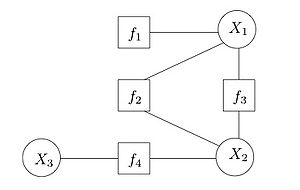

# Factor graph
A factor graph is a bipartite graph where one group is the variables in the distribution being modeled, and the other group is the factors defined on these variables. Edges go between factors and variables that those factors depend on/

