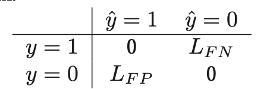
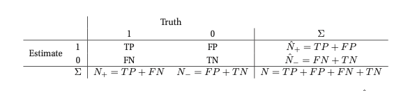
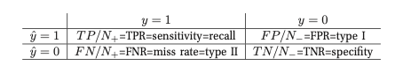
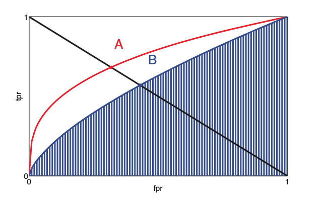
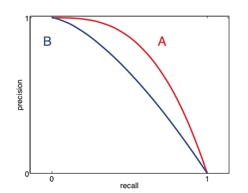

# False positive vs false negative tradeoff

In binary classification problems, there are two types of errors that can happen:

1. False positive (False alarm) we estimate $\hat{y} =1$ but the truth is $y =0$ 
2. False negative (Missed detection) we estimate $\hat{y} = 0$ but the truth is $y =1$

We can define a define a different loss to different scenarios:

Where:

* $L_{FP}$ is the cost of false positive
* $L_{FN}$ is the cost of false negative 

Given these 2 values we can define a threshold how to classify if:

$L_{FN} = cL_{FP}$ , than we should pic $\hat{y} = 1$ iff $\frac{p(y = 1|x)}{p(y=0|x)} > \tau, \tau = \frac{c}{1+c}$ . For an example if the cost of false negative is twice as much as false positive, $c=2$ than we use a decision threshold of 2/3. 

## ROC curves

ROC cures to generalize this FP-FN tradeoff. 

* $N_+$ is the true number of positives
* $\hat{N}_+$is the estimated number of positives
* $N_-$ is the true number of negatives
* $\hat{N}_-$ is the estimated number of negatives 

### Confusion matrix

1. **True positive rate** (TPR) (Sensitivity, recall or hit rate) 

   $$TPR = TP/N_+ \approx p(\hat{y} =1|y=1)$$

2. **False positive rate** (FPR) (False alarm rate, type 1 error) 

   $$FPR = FP /N_- \approx p(\hat{y} = 1|y=0)$$

3. **False negative rate** (FNR) (Miss rate, type 2 error)

   $$FNR = FN/N_+ \approx p(\hat{y}=0|y=1)$$

4. **True negative rate** TNR (specifity)

   $$TNR = TN /N_- \approx p(\hat{y}=0|y=0)$$

Now we can plot the **ROC** which is just ration between TPR and FPR for a waring threshold $\tau$

(A is better than B)

We can characterize this curve as single number summary, if we take the area under the curve.  (**ROC AUC**). Where the higher AUC the better the performance.

### Precision recall curves

In cases that we have very little positive samples,  or in cases where the notion of negative is not well defined we can use **precision recall curve** instead.

(A is better than B)

#### Precision

$$TP/\hat{N}_+  = p(y=1| \hat{y}=1) = \frac{\sum_i y_i \hat{y}_i}{\sum_i \hat{y}_i}$$

#### Recall

$$TP/N+ = p(\hat{y} = 1| y =1) = \frac{\sum_i y_i \hat{y}_i}{\sum_i y_i} $$

### F-Scores

For a fixed threshold we can compute a single precision and recall value, and combine them in a single statistics the **F-score**, or **F1 socre** which is the harmonic mean of precision and recall:

$$F1 \triangleq \frac{2PR} { R + P}$$
