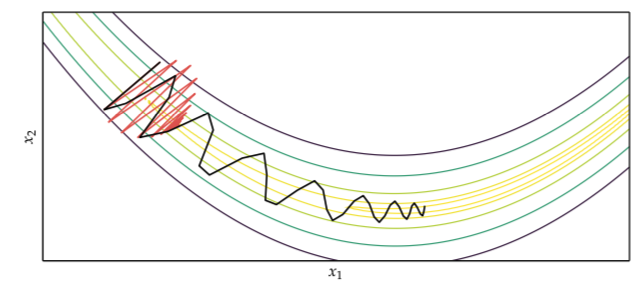
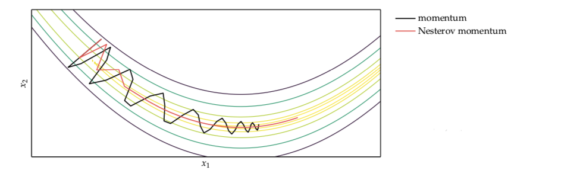

// TODO Shorten
# First order Methods

First order method rely on the gradient information to select the direction of descent.

# [Gradient descent](gradient_descent.md)
The direction of steepest descent is an obvious choice for the descent direction $d$. 

$$
g^{(k)} = \nabla f(x^{(k)})
$$

# [Conjugate gradient](conjugate_gradient.md)
It borrows inspiration from methods that optimize quadratic function:

$$ \min_x f(x) = \frac{1}{2}x^TAx + b^Tx + c $$

* $A_{n\times n}$ is symmetric and positive definite thus $f$ as a unique global minimum.

This can be optimized in $n$ steps.

# Momentum
Gradient descent will take a long time to traverse a nearly flat surface:

We can speed up the progress by adding momentum:

$$
v^{(k+1)} = \beta v^{(k)} - \alpha g^{(k)} \\
x^{(k+1)} = x^{(k)} + v^{(k+1)}
$$

# Nesterov momentum
One issue with momentum is that it does not slow down enough at the bottom of the valley and tend to overshoot the bottom. Nesterov ads an modification that decreases the momentum in higher iterations:

$$v^{(k+1)} = \beta v^{(k)} - \alpha \nabla f(x^{(k)} + \beta v^{(k)})$$
$$x^{(k+1)} = x^{(k)} + v^{(k+1)}$$

## Algorithm
Initialize:
$\alpha$ learning rate, $\beta$ momentum decay, $v = 0$ momentum

Iterate:
$v = \beta v - \alpha \nabla f(x + \beta v)$

return $x$

# [Adagrad](adagrad.md)
Adapts a learning rate for each component of x, it excels when the gradient is sparse. 

# [RMS-Prop](rms_prop.md)
Improves on adagrad to avoid dimishing gradient.

# [Adam](adam.md)
Similar to RMS prop but ads also decaying momentum.

# [Hyper gradient descent](hyper_gradient_descent.md)

The rough idea is that we apply gradient descent to the learning rate.
