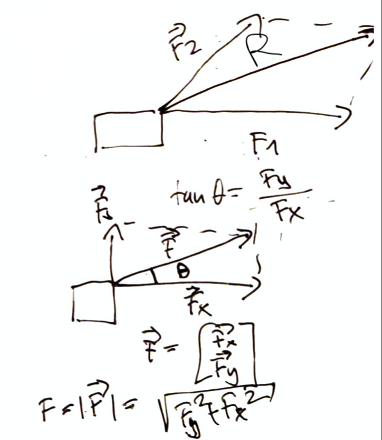

# Force and motion

## Force
Describes interactions between two objects or an object and environment.

[Newtons Laws](newtons_laws.md) gives us an toolkit how to handle these interactions.

### Types of forces
* contact (Between two objects)
  * normal force ($\vec{n}$) object rests on a surface the normal force is perpendicular to the surface (surface pushes the object upwards)
  * friction ($\vec{f}$) acts parallel to the surface (if we slide something there is friction, it is always opposite to the direction it moves)
* tension ($\vec{t}$) force applied to an object pulled by a rope
* weight ($\vec{v}$) gravitational attraction

## Resultant of force (super position of forces)
If two forces act on the same object at the same time, the effect is the same as if a single force would act.

$$
\vec{R} = \vec{F}_1 + \vec{F}_2 \\
$$

We can express any force by its components:

$$
\vec{R} = \vec{F}_1 + \vec{F}_2 + \cdots = \sum \vec{F} \\
R_x = \sum \vec{F}_x \\
R_y = \sum \vec{F}_y
$$
