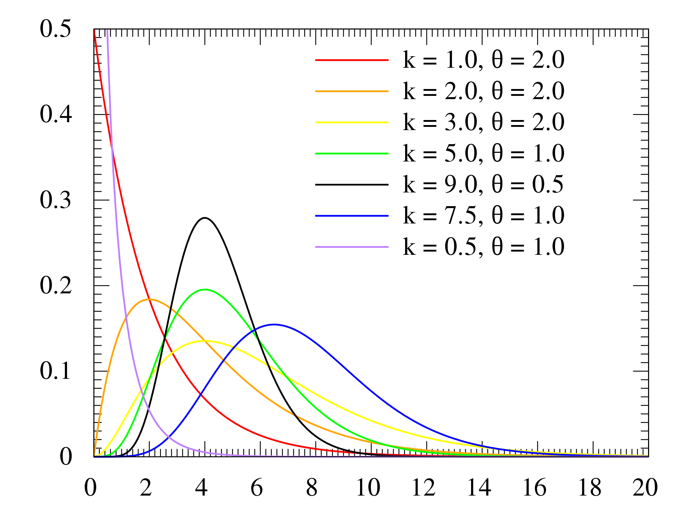

# Gamma distribution
Gamma distribution can be viewed as the total waiting time, till we reach $a$ successes. It  generalizes the Exponential r.v, where the Exponential r.v is the waiting time for the first success under condition of memorylessnes. We can view the Gamma distribution as a sum of i.i.d Exponential r.v.s. Of we can see the Gamma as the continuous analog of the Negative Binomial distribution. 

$$X \sim Gamma(a,\lambda)$$

## PDF

**In terms of shape $(k)$ and scale $(\theta)$**

$$f(x| k, \theta) = \frac{1}{\theta^k} \frac{1}{\Gamma(k)}x^{k-1} e^{-\frac{x}{\theta}}$$

**In terms of shape ($\alpha$) and rate ($\theta$)**

$$ f(x| \alpha, \beta) = \beta^{\alpha} \frac{1}{\Gamma(\alpha)}x^{\alpha -1} e^{-\beta x}, x> 0, \text{ and } \alpha, \beta> 0$$

# Moments

## Mean

$E[X] = \frac{a}{\lambda}$

## Variance

$Var(X) = \frac{a}{\lambda^2}$

# Properties
* the shape parameters defines the number of events (thus it can be any positive number)
  * shape values less than 1, Gamma distribution has a mode of 0
  * shape value equal to 1, gamma distribution is equivalent to exponential distribution 
  * shape values greater than 1, the distribution becomes increasingly more symmetrical and approaches a normal distribution when the shape parameter is large. 

* The **scale** and **rate** (rate = 1/scale) parameter defines how often (scale) and rate at which events are expected to occur
* The variance is proportional to the mean (variance = scale/mean, variance = mean^2/ shape) 

# Sum of 2 Gamma distributions

If 2 or more gamma distributions have the same rate $\alpha$

* $X \sim Gamma(a, \lambda)$  

* $Y \sim Gamma(b, \lambda)$ 

Then we can define the sum of 2 or more as:

$$T = X + Y \sim Gamma(a+b, \lambda)$$

# Connection to Exponential distribution

And since there is a connection between the Exponential and Gamma:

$$X \sim Gamma(1, \lambda) = Expo(\lambda)$$

# Connection to Beta distribution

$$\frac{1}{\beta(a,b)} = \frac{\Gamma(a + b)}{\Gamma(a)\Gamma(b)}$$

* $\Gamma$ is the [gamma functiin](gamma_function.md)
## Connection to Normal distribution
Gamma distribution can be used as an alternative to Normal distribution when data (residuals) are skewed with a long right tail, **when there is an relationship** between **mean and variance**.

It is a [conjugate prior](conjugate_prior.md) for the variance of a normal distribution.

# Erlang distribution
Parameter $a$ is a integer, which is commonly fixed yielding a one parameter Erlang distribution, 
$$Erlang(x| \lambda)= Ga(x| 2, \lambda)$$ 

*  fix $a = 2$)
*   $\lambda$ is the rate parameter. 