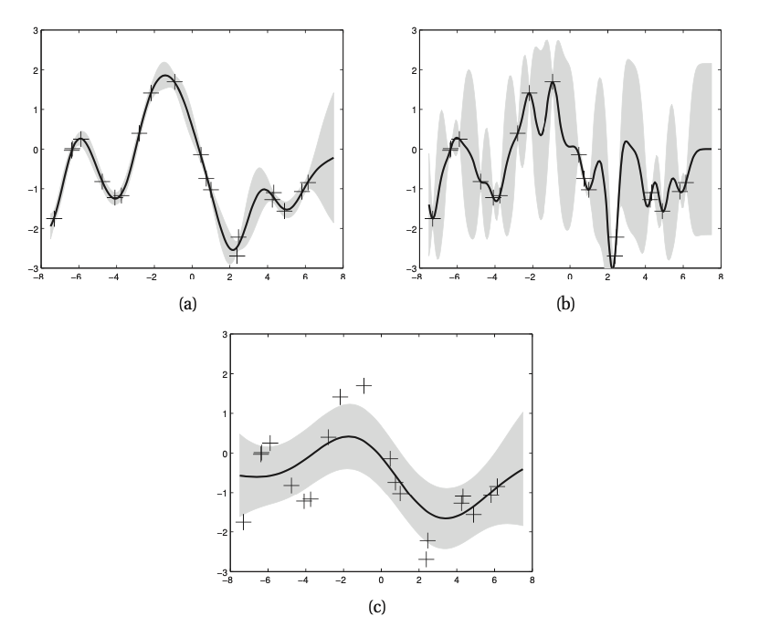

# Gaussian Process Regression

Let the prior on the regression function be a GP denoted as:

$$
f(x) \sim GP(m(x), \mathcal{k}(x, x'))
$$
* $m(x)$ is the mean function
* $\mathcal{k}(x,x')$ is the kernel or covariance function, hence it is required that 
$$
m(x) = E[f(x)] \\ 
\mathcal{k}(x, x') = E[(f(x) - m(x))(f(x') - m(k'))^T]
$$

We require $\mathcal{k}()$ to be a positive definite kernel. For any finite set of points, this process defines an joint Gaussian:

$$
p(f|X)= \mathcal{N}(f|\mu, K)
$$

* $K_{ij} = \mathcal{k}(x_i, x_j)$
* $\mu = (m(x_1), \cdots, m(x_M))$

It is commont to use a mean function of $m(x)= 0$, since the GP is flexible enough to model the mean arbitrarly well.

## [Noise free observations](noise_free_gaussian_process_regression.md)
We assume that the obserations are noise free. In this case the Gaussian process has to interpolate the observations.

## [Noisy observations](noisy_gaussian_process_regression.md)
Here wo do not require that the Gaussian process interpolates the observations (but it has to be close).

## Effect of the kernel parameters

The predictive performance of GPs depends exclusively on the suitability of the chosen kernel.

* $(l, \sigma_f, \sigma_y)$
* a) Noise free GP with RBF kernel (1,1,0.1)
* b)  Noise free GP with RBF kernel (0.3, 0.108, 0.00005)
* c)  Noisy GP with RBF kernel (3.0, 1.15, 0.89)

## Semi parametric GP

We assume that the mean of the process is a linear model:

$$
f(x) = \beta^T \phi(x) + r(x)
$$

* $r(x ) \sim GP(0, k(x,x'))$ models the residuals

Here we combine parametric and nonparametric models (semi-parametric model)
