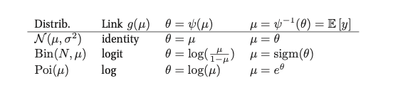

# Generalized linear models

Models in which the output density is in the [exponential family](exponential_family.md) and in which the mean parameters are a linear combination of the inputs passed through a possibly nonlinear function.

Let us define an unconditional distribution fo a scalar response variable:

$$p(y_i| \theta, \sigma^2) = \exp [\frac{y_i \theta - A(\theta)}{\sigma^2} + c (y_i, \sigma^2)]$$

* $\sigma^2$ is the dispersion parameter (ofthen set to 1)
* $\theta$ the natural parameter
* $A$ is the log partition function
* $c$ is a normalization content 

To get from the mean to the natural parameter we need a converting function $\psi$, hence $\theta = \Psi(\mu)$.  In general the from of this function uniquely determines the form of the exponential faimly distribution. This function is invertible hence $\mu = \Psi^{-1}(\theta)$. And since the derivative of the log partition function gives us the mean we get: $\mu = \Psi^{-1}(\theta) = A'(\theta)$.

Now if we add inputs/covariates, and define a linear function:

$$\eta_i = w^Tx_i $$

Now we make the mean of the distriubtion some invertible monotonic function of this linear combination. This function is known as the **mean function** and is denoted as $g^{-1}$:

$$\mu_i = g^{-1}(\eta_i) = g^{-1}(w^Tx_i)$$

* $g$ is also called the **link function** hence $g^{-1}$ is sometimes called the **inverse link function**. And we can choose any function to be g but it has to be invertible. If $g = \psi$ than we call it the **canonical link function** 

> If $\theta_i = \eta_i = w^Tx_i$ into our uncoditional distribution we get: 
> $$p(y_i| \theta, \sigma^2) = \exp [\frac{y_i w^tx_i - A(w^Tx_i)}{\sigma^2} + c (y_i, \sigma^2)]$$

The following talbes gives us an list of some distributions and their canonical link functions.

## Examples

### Linear regression:

$$
\log p(y_i| x_i, w, \sigma^2) = \frac{y_i \mu_i - \frac{\mu_i^2}{2}}{\sigma^2} - \frac{1}{2}(\frac{y_i^2}{\sigma^2} + \log (2 \pi \sigma^2))
$$

* $y_i \in R$
* $\theta_i = \mu_i = w^Tx_i$
* $A(\theta) = \theta^2/2$
  * $E[y_i] = \mu_i$ 
  * $var(y_i) = \sigma^2$

### Binomial regression

$$
\log p(y_i| x_i, w) = y_i \log \frac{\pi_i}{1 - \pi_i} + N_i \log (1 - \pi_i) + \log \binom{N_i}{y_i}
$$

* $y_i \in \{0, 1, \cdots, N_i \}$
* $\pi_i = sigm(w^Tx_i)$ 
* $\theta_i = \log(\pi_i / (1 - \pi_i)) = w^Tx_i$
* $\sigma^2 = 1$
* $A(\theta) = N_i \log (1+ e^{\theta})$
  *  $E[y_i] = N_i \pi_i$
  *  $var[y_i] = N_i \pi_i(1 - \pi_i)$

### [Poison regression](poisson_regression.md)

$$
\log p(y_i| x_i, w) = y_i \log \mu_i - \log(y_i!)
$$

* $y_i \in \{0,1,2, \cdots \}$
* $\mu_i = \exp (w^Tx_i)$
* $\theta_i = \log(\mu) = w^Tx_i$
* $\sigma^2 = 1$
* $A(\theta) = e^{\theta}$
  * $E[y_i] = var[y_i] = \mu_i$

## MLE and MAP estimation
An appealing properties of GLM is that they can be fit using exactly the same methods that we used to fit [logistic regression](logistic_regression.md).

## Bayesian inference 
In general we use MCMC 

