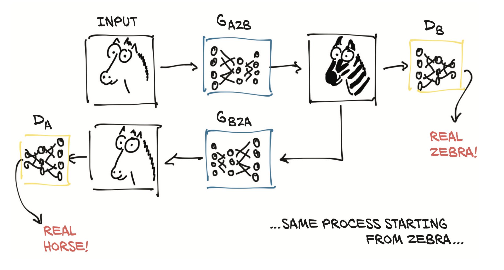

# Generative Adiversal Networks (GAN)

The basic idea is to have two competing networks (Generator <=> Discriminator). The first generates fake pictures (or other things) from random noise, and the second discriminator serves a judge to determine if the picture is fake. By imporoving the generation of fake we can get to a point where the judge cannot determine if it is fake or not. 

## CycleGAN
GANs are not really stable during training, the idea is to have two sets of generator and judges.

The first generator networks takes an real image (example a Horse) and turns it into an another image (zebra) passes to an discriminator who than judges if it is true or fake. The generated image is than passed to an second Generator network that tries to transform it back to the real image (Horse) and pass it to the Second Discirimnator to determine if it fake or true.

The training proceeds until we generate images that can fool booth discriminators.