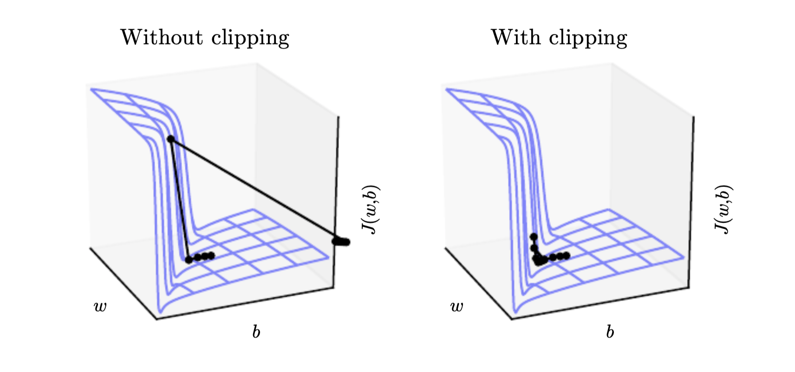

# Gradient clipping
The derivatives of strongly non linear functions, like in [recurrent neural networks](recurrent_neural_networks.md) computed over many steps, tend to get very large or small in magnitude.

Because of this if we perform gradient descent we can be thrown far away in the parameter space:

Gradient clipping clips the norm $||g||$ of the gradient, the parameter update than becomes:

$$
||g|| > v \\
g = \frac{gv}{||g||}
$$

If the norm of the gradient is larger than some threshold we later the gradient. If we clip the gradient we still go in the right direction, but we wont make an too large step. If the gradient would be NaN or Inf than we move in a random direction to get a way from an unstable region.