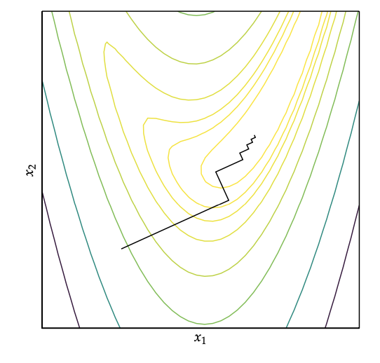

# Gradient descent

The direction of steepest descent is an obvious choice for the [descent direction](local_descent.md) $d$. Following this direction we are guaranteed to improve if the objective function is smooth and the step size is sufficiently small. The direction of steepest descent is the direction opposite to the gradient.

$$
g^{(k)} = \nabla f(x^{(k)})
$$

* $x^{(k)}$ is the design point at the kth iteration

We typically normalize the direction of the steepest descent

$$
d^{(k)} = - \frac{g^{(k)}}{||g^{(k)}||}
$$

If we choose the step size that leads to maximal increase in f. This direction is always orthogonal to the current direction, and it will lead to an jagged search path.

We can prove this by first starting with the following minimization:

$$
\alpha^k = \arg \min_{\alpha} f(x^{(k)} + \alpha d^{(k)})
$$

We have to find the gradient with respect to $\alpha$ and set it to zero:

$$
\nabla f(x^{(k)} + \alpha d^{(k)})^T d^{(k)} = 0
$$

Now we know 
$$
d^{(k=1)} = \frac{\nabla f(x^{(k)} + \alpha d^{(k)})}{|| \nabla f(x^{(k)} + \alpha d^{(k)}) ||}
$$

We can substitute it in the equation before:

$$
d^{(k+1)T} d^{(k)} = 0
$$
Here we can drop the $-$ sign and the normalization since it wont change the fact that the vectors are still orthogonal.

## Algorithm
We require $f, \nabla f$ and a learning rate $\alpha$

* for each iteration i:
  * $g_i = \nabla f(x^{(i)})$
  * return $x_i - \alpha \cdot g_i$   

# Convergence
If we want stochastic gradient descent to converge we need the learning rate to be:
$$\sum_{k=1}^{\infty} \alpha_k = \infty, \sum_{k=1}^{\infty} \alpha_k^2 \le \infty $$