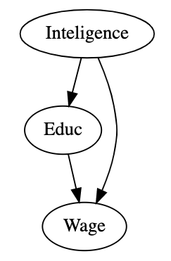
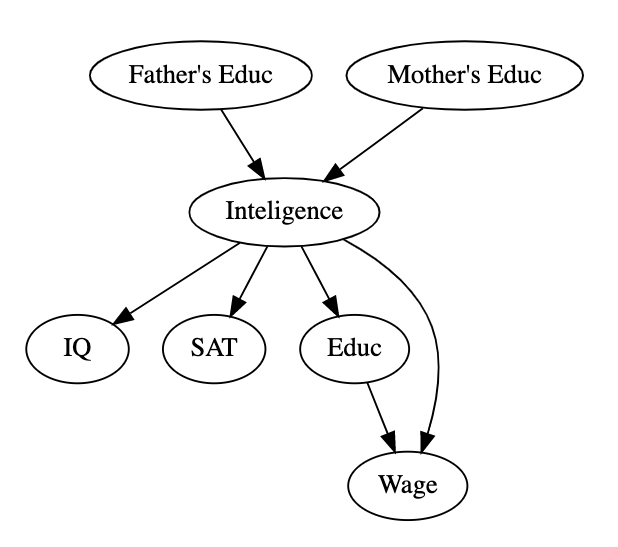
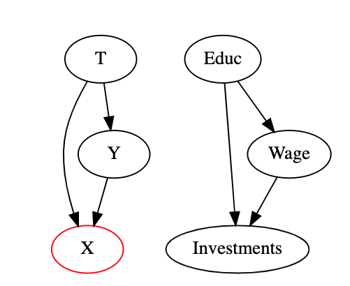
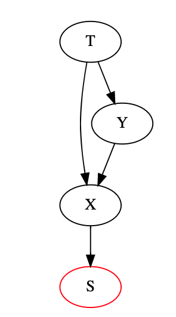
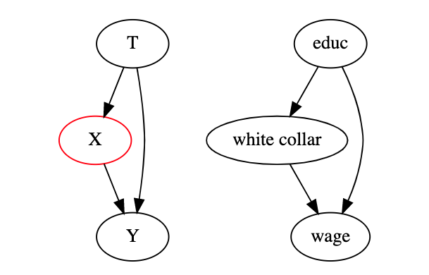

# Graphical [causal models](causality_intro.md)
* conditional independence of potential outcomes
    $$
    (Y_0, Y_1) \perp T |X
    $$
  * this allows measure an effect tht is due treatment

## Example
* we are testing the efficiency of a drug
* severity of illness may mix up the effect of the drug
* an common approach is to divide patients into two groups, severe and not server illness and analyze the efficiency in very subgroup
* this braking down of population is also known as "controlling" or "conditioning" on
* if the treatment is than assigned at random, the treatment becomes conditionally independent of potential outcomes

* by designing problems as [directed graphical models](directed_graphical_models.md) we can diagnose different kinds of biases 

## Confounding bias
* treatment and outcome share a common cause
  * Example: Education is the treatment and the outcome is income booth share a common cause intelligence
    
    
    * we can argue that intelligent people have higher wage not necessarily because of education
    * to identify causality we have to close all the back door paths between the treated
    * we control on intelligence, thus we compare people with similar intelligence, with the only difference is education, any difference in the outcome is only due the difference in education

* in order to fix confounding bias, we need to control all common causes of the treatment and the outcome
* unfortunately it is not always possible to control for all common causes, some variables are unobserved
* in some cases unmeasured variables cause the outcome and the treatment directly
  
  * intelligence is unobserved (impossible to observe directly), but we can control on the parents education, and some effects of intelligence as SAT or IQ
    * this however wont eliminate bias, but it helps

  * if we cannot control directly on a variable we can find variables that act as a proxy for the confounder
    * this wont eliminate the bias just lowers it
    * these proxy variables are called surrogate confounders

## Selection bias
* we control for more variables than we should 
  
  * we are interested in the effect of education on the wage
  * we control on investment, but investment is not an common cause but an consequence of booth
    * this opens an collider structure and makes the causal effect harder to estimate

* selection bias also happens if we condition on any descendant of a common effect
  
    * we have conditioned on S 
* if we condition on a mediator of a treatment
  
  * by conditioning on white collar we close a channel trough the treatment operates