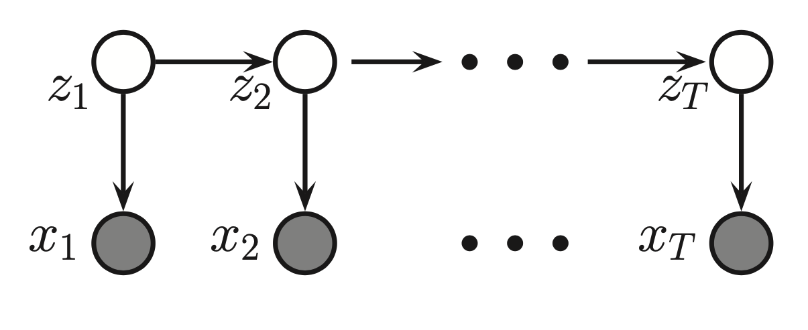
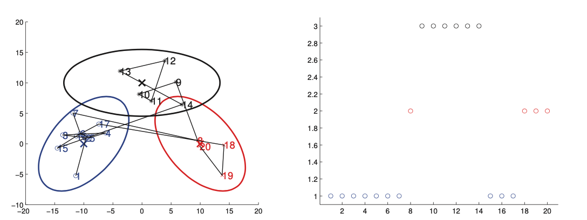

# Hidden Markov models

A hidden markov model HMM consists of discrete-time discrete-state Markov chain, with hidden states $z_i \in \{1, \cdots, K \}​$, observations $x_1, \cdots, x_T​$ plus and **observation model** $p(x_t|z_t)​$.

The corresponding join distribution has the form:

$$
p(z_{1:T}, x_{1:T}) = p(z_{1:T})p(x_{1:T}|z_{1:T}) = [p(z_1)\prod_{t=2}^T p(z_t|z_{t-1})][\prod_{t=1}^T p(x_t|z_tff )]
$$

* $p(z_t| z_{t-1}) = (i,j)$ are the transition probabilities between hidden states, T is a transition (stochastic) matrix
* $p(x| z_{k} =i) = \epsilon_i(x)$ are the emission probabilities, this is the probability that we emmit x given that our hidden state is z.
* $p(z_1)$ is the initial distribution

This factorization enables us to perform tractable inference in Hidden Markov models. Since the observations are conditionaly dependent only on the given hidden state.

If the observations are continuous than the observation model can be an conditional Gaussian:

$$p(x_t|z_t=k|\theta) = \mathcal{N}(x_t| \mu_k, \Sigma_k)$$

Left picture shows 2d data samled from a 3 state HMM. Each state emits from an 2d Gaussian. The right is the hidden state sequence/

The result is similar to a Gaussian mixture model, expect the cluster membership has Markovian dynamics. 

The essence of Hidden Markov models that we do not observe the true state of the system perfectly. Hence we can break the model into 2 parts, a visible state and a hidden state. Where we the hidden state is modeled as a markov chain. 

## [Infference in HMMs]()

We now discuss how to infer the hidden state sequence of an HMM, assuming the parameters are known.

There are different kinds of inference:

1. **Filtering** means to compute the belief state $p(z_t| x_{1:t})$ online, or recursively as the data streams in. It is called filtering because it reduces the noise more than simply estimating the hidden state using just the current estimate $p(z_t| x_t)$.
2. **Smoothing** means to compute $p(z_t|x_{1:T})$ offline, given all the evidence. Conditioning on the past and future data, our uncertainity will be significantly reduced. (This can be intutively seen as, "aha" moment, when sudenly everything makes more sence)
3. **Fixed smooting** is an compromise between online and offline estimation. It involves computing $p(z_{t-l}| x_{1:t})$, where $l > 0$ is called the lag. Gives better performance than filtering, but incurs a slight delay. 
4. **Prediction**. Instead of prediciting the past given the future, as in fixed lag smoothing, we might want to predict the future given the past, compute $p(z_{t+h}| x_{1:t})$ where $h > 0$ is called the prediction horizon. 
5. **Map estimation**. We compute $\arg \max_{z_{1:T}} p(z_{1:T}| x_{1:T})$ which is the most-probable state sequence. In context of HMMs, this is known as Viterbi decoding. 
6. **Posterior samples**. If there is more than one plausible interpretation of the data, it can be useful to sample from the posterior, $z_{1:T} \sim p(z_{1:T}| x_{1:T})$. These sample paths contain much more information than the sequnce of marignal computed by smoothing.
7. **Probability of evidence**. We can compute the probability of evidence $p(x_{1:T})$ by summing up over all hidden paths, $p(x_{1:T}) = \sum_{z_{1:T}} p(z_{1:T}, x_{1:T})$. This can be used to classify sequences for model based clustering, for anomaly detection. 

