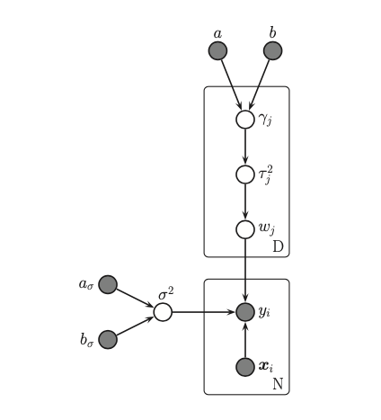
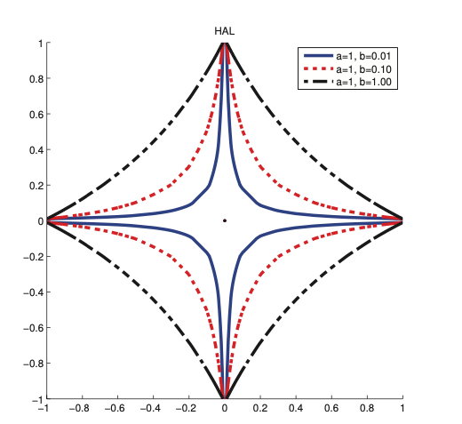

# Hierarchical adaptive lasso

Principal problems with [lasso](l1_regularization.md) is that it results in biased estimates. This is because it needs to use a large value of $\lambda$ to “squash” the irrelevant parameters, but this then over-penalizes the relevant parameters. It would be better if we could associate a different penalty parameter with each parameter. 

$$
\gamma_j \sim IG(a, b) \\
\tau_j^2| \gamma_j \sim Gamma(1, \gamma_j^2/2) \\ 
w_j | \tau_j^2 \sim N(0, \tau_j^2)
$$

This model is known as **hierarchical adaptive lasso**. It yields an result that is much sparser than yielded by Lasso, but it is also less biased.

Compared to the diamond shaped Laplace penalty, the HAL penalty looks more like a starfish. Hence it puts more density on the spikes, thus enforcing sparsity more aggressively. **This penalty is not convex**.
