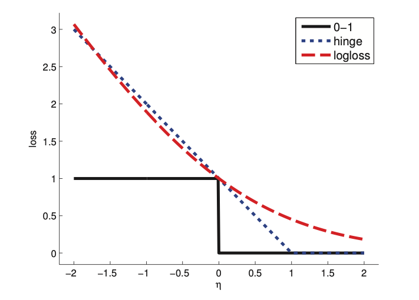

# Hinge loss

Loss of the form:

$$
L_{\text{hinge}} (y, \eta) = \max(0, 1 - y \eta) = (1 - y\eta)_{+}
$$

* $\eta = f(x)$ is our confidence in choosing label $y=1$. (Without any probabilistic semantics)

The function looks like a door hinge:

