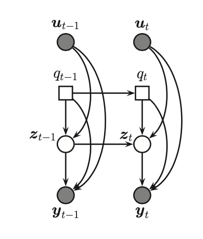

# Hybrid discrete/continuous SSMs

Is a system that contians booth continuous and discrete hidden variables. A special case where we combine an HMM and LG-SSM we get **switching linear dynamical system (SLDS)**, also called a **jump Markov linear system (JMLS)** or  **swithcing state space model (SSSM)**.

More precisely we have:

* $q_t \in \{ 1, 2, \cdots, K \}$ is a *Discrete* latent variable
* $z_t \in R^n$ is a *Continuous* latent variable
* $y_t \in R^D$ is the *Continous* observed random variable
* $u_t \in R^{U}$ is the optional *Continous* observed user input

Here we assume that the continous latent variables have a Linear Gaussian CPD conditional on the discrete state:

$$ 
p(q_t=k|q_{t-1} = j, \theta) = A_{ij} \\
p(z_t| z_{t-1}, q_t = k, u_t, \theta) = \mathcal{N}(z_t| A_k z_{t-1} + B_k u_t, Q_t) \\
p(y_t| z_t, q_t = k, u_t, \theta) = \mathcal{N}(C_kz_t + D_k u_t, R_k)

$$ 

Where we can draw it as a graphical model:

## Inference 

Unfortunately infrence in hybrid models, including switching LG-SSM model is intractable. Hence we need to use approximate inference methods:

1. MC methods

## Application

1. Econometric forecasting
2. Multi-target tracking
3. Fault diagnosis

