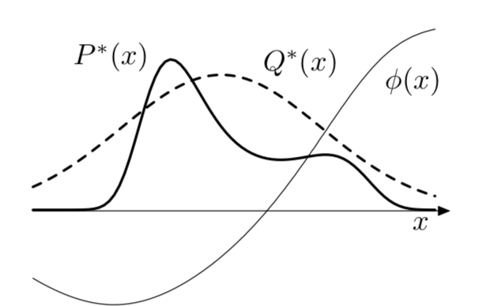

# Importance sampling

If we can evaluate $P(x)$ at any point x up to a multiplicative constant $P(x) = P^*(x)/Z$, but $P(x)$ to complex to sample directly. Now we take a simpler distribution $Q(x)$ which we can draw samples from directly, up to a multiplicative constant $Q(x) =Q^*(x) / Z_Q$.

Now some samples x from Q will overestimate P(x) and some samples will under estimate P(x).

To take account this difference we introduce weights:

$$w_r = \frac{P^*(x^r)}{Q^*(x^r)}$$

which will adjust the importance of each point in our estimator thus:

$$\Phi \equiv \frac{\sum_r w_r \phi(x^r)}{\sum_r w_r} $$

Here if $Q(x)$ is non-zero for all x where $P(x)$ is nonzero then the value of $\bar{\Phi } \rightarrow \Phi$ as the number of samples increases. And $\phi(x)$ is our expectation we want to estimate under $P(x)$.

## Challanges
It is difficult ot estimate how reliable the estimator $\bar{\Phi}$ is. The variance of this estimator is hard to estimate. (The empirical variance of $w_r$ and $w_r \phi(x^r)$ are not necessarily similar to the true variacnes). 

It can happen that $Q(x)$ is small where $|\phi(x)P^*(x)|$ is large, then there is a possibility that even afther many samples $x^r$ non of them would fall in that region. In this case the estimator for $\Phi$ would be drastically wrong. 

## Choosing the approximation function Q

Importance sampling is NOT useful if the importance weights wary substatially. The worst scenario is when the importance ratios are small with high probability, and huge with small probability. This happens if P has wider tails than Q. 

## Accuracy and efficiency of importance sampling estimates

We can analyze the distribution of importance weights to discover possible problems. In general if the largest ratio is too large compared to the average, then the estimates are ofthen poor.

If the wariance of the weights is finite we can estimate the effective sample size:

$$S_{eff} = \frac{1}{\sum_{s=1}^S (\tilde{w}(\theta^s))^2} $$

* $\tilde{w}(\theta^s) = \frac{w(\theta^s)}{\sum_{s=1}^S w(\theta^s)}$ are the normalized importance weights

If this quantity is small, then there are a few extremly large weights, that influce the distribution. 

## Importance re-sampling (SIR sampling-importance re-sampling)

Here we want to take importance weights drawn by importance sampling and transform them so we obtain independent samples with equal weights.

We assume that we have S samples $\{ \theta^1, \cdots, \theta^S \}$ using importance sampling, where each sample $\theta^i$ has the weights $w(\theta^i) = \frac{p^*(\theta^s| s)}{g(\theta)}$

**Steps**

1. Sample $\theta$ from the set of samples $S$, where the probability of sampling is proportional to $w(\theta^s)$

2. Sample a second value, with the same procedure, but exlude the already sampled value
3. Repat without replacement $k-2$ times. 

### Remarks
Importance sampler should be a distribution that has heavy tails. 
It is nearly impossible to use in high dimenssion since it will be dominated by a few huge weights. 