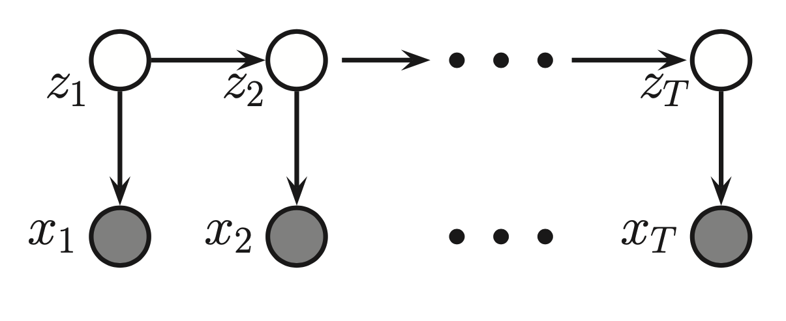

# Inference in [hidden markov models](hidden_markov_models.md)

The main idea is how to perform marginal inference on the hidden states given observed. Or perform parameter estimation and so on.
# Forward-Backward

For a hidden markov model of a form:

We are given:
* initial probabilities $p(z_1)$
* transition probabilities $p(z_{k+1}|z_k)$
* emission probabilities $p(x_k|z_k)$

The main goal of the Forward-Backward algorithm is to compute the marginals of form:

$$
p(z_k|x_{1:n}) \propto p(z_k,x_{1:n}) = p(x_{k+1:n}|z_k)p(z_k,x_{1:k})
$$

This estimation consists of two steps:

1. Forward pass $p(z_k,x_{1:k})$
2. Backward pass $p(x_{k+1:n}|z_k)$

> Example:
> 
> 
> 
## Forward
## Backward

# MAP estimation (Viberty)