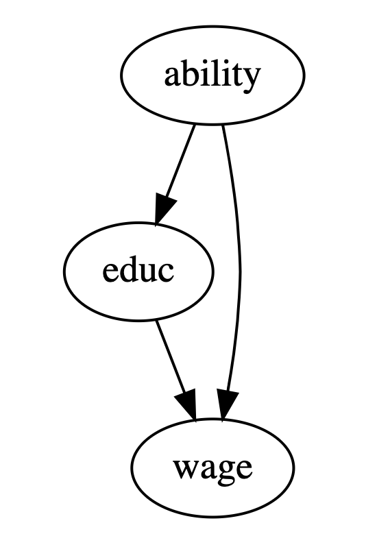
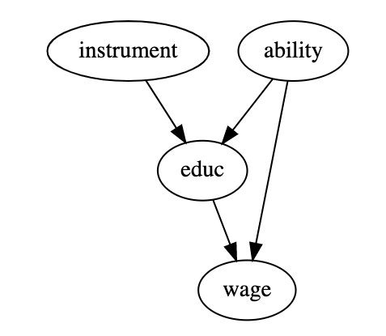
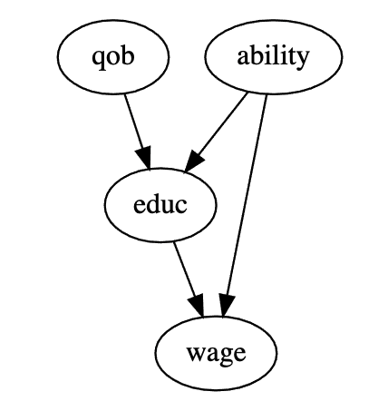

# Instrumental variables

* there are several approaches to control for ommited variable bias, in the simplest case we just include the ommited variable, unfortunatelly in most cases this is not possible

    
  
  * interested are we on the impact of education on wage, we want to condition on the ability which is the confounder but it is not available
  * we search for a proxy for ability like IQ

* we search for a instrumental variable
  * instrumental varialbes cause the treatment and they are correlated with the outcome only trough the treatment

    

  * we use the IV formula to recover the causal effect
    * first we assume
    $$ Y_i = \beta_0 + k T_i + \beta W_i + \mu_i $$
      * k is the causal effect
      * $T_i$ is the treatment variable
      * $W_i$ are confounders 
    * unfortunately $W_i$ is not available
    * we compute this instead
    $$
    Y_i = \beta_0 + k T_i + v_i
    $$
    * $v_i = \beta W_i + \mu_i$ this is also known as short version
    * $W_i$ is a confounder thus $Cov(T,v) \ne 0$, in our example we say that ability is correlated with education

  * since the instrumental variable Z is correlated with the outcome only trough T it implies that $Cov(Z,v) = 0$ otherwise there would be a part from Z to outcome
  * this yeilds:
    $$
    Cov(Z,Y) = Cov(Z, \beta_0 + KT_i + v_i) = k Cov(Z,T) = kCov(Z,T) \\
    k = \frac{Cov(Y_i,Z_i) / Var(Z_i)}{Cov(T_i,Z_i)/Var(Z_i)}  = \frac{\text{reduced form}}{1 st stage}
    $$
  * booth nominator and denominator are regression coefficients (covariance divided by variance)
    * the nominator (reduced form) is a regression of Y on Z, called impact of Z on Y, it captures how big the impact of Z on Y is trough T
    * dnominator (reduced form), regression of T on Z, impact of Z on T

  * we can examine it from a view of partial derivatives:
    $$
     k = \frac{\frac{\partial y}{\partial z}}{\frac{\partial T}{\partial z}}  = \frac{\partial y}{\partial z} \frac{\partial z}{\partial T} = \frac{\partial y}{\partial T}
    $$
    * we cannot find the input of T on Y directly (because of confounders)
    * we can easily find the impact of Z on Y since Z does not directly influence Y
    * we can estimate the effect of T on Y and scale it by the effect of Z on T
    * if the instrumetnal variable is a dummy variable it simplifies to:
    $$
    k = \frac{E[Y|Z=1] - E[Y|Z=0]}{E[T|Z=1] - E[T|Z=0]}
    $$
    * this is known as **Wald Estimator**
    * the general idea is that the effect of T on Y is hard, but Z on Y is easy. Since Z influences Y only trough T. Thus we convert Z on Y to Y on Y by scaling Z on Y by the effect of Z on T.

## Example:

  * qob denotes the quarter of birth
  * educ is the treatment
  * wage is the common effect
  * ability is the hidden unobserved cofounder

* qob is the instrumental variable
  * first we check if $Cor(Z,T) \ne 0$, this is easy
  * $Y \perp Z | T$ this is not possible to check, thus we can only reason in favour of 

* we compute the first stage
  $$
  \text{year of birth} \sim c(\text{year of birt}) + c(\text{state of birth}) + q_4
  $$
* compute the reduced form
  $$
  \log(wage) \sim c(\text{year of birth}) + c(\text{ state of birth}) + q_4
  $$
* instrumental variable
  $$ ATE_{iv} = \frac{\text{reduced form}}{\text{first stage}} = \frac{q_{4, reduced}}{q_{4, first stage}}$$

## Second stage
* first stage as is 
* the second stage we replace the treatment variable with the fit form the first stage

$$
educ_i = \gamma_0 + \gamma_1 q4_{i} + \gamma_2 yob_i + \gamma_3 sob_i + v_1 \\
\log(wage)_i = \beta_0 + \beta_1 educ_i + \beta_2 yob_i \beta_3 sob_i u_i \\
\log(wage)_i = \beta_0 + \beta_1[\gamma_0 + \gamma_1 q4_{i} + \gamma_2 yob_i + \gamma_3 sob_i + v_1] + \beta_2 yob_i \beta_3 sob_i u_i
$$

* any control in the first stage is in the second stage as ell

## Multiple instruments
* the second stage can incorporate multiple instrument variables

log_wage ~ 1 + C(year_of_birth) + C(state_of_birth) + [years_of_schooling ~ q1+q2+q3]

## Weakness of instrumental variables
* if the impact of the treatment is strong, the second stage is also strong but if the first stage is weak, than the overal effect is weak
* having an low correlated IV with treatment will result in weak IV
* 2SE is biased, it will only approach the true param wen n is large, however it is consistent