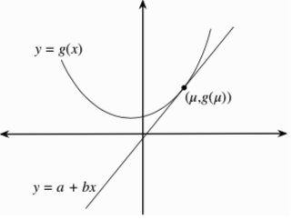

# Jensens inequality

If we take expectations for a function the following holds:

$$
E[g(X)] \ne g(E[X])
$$

However if $f$ is a [convex function](./convex_function.md) than we can prove that:

$$E[g(X)] \ge g(E[X]) $$

## Prof

$$E[g(x)] \ge E[a + bX] = a + bE[X] = a+b\mu = g(\mu) = g(E[X]) $$

## Concave functions

$$
E[g(X)] \le g(E[X])
$$