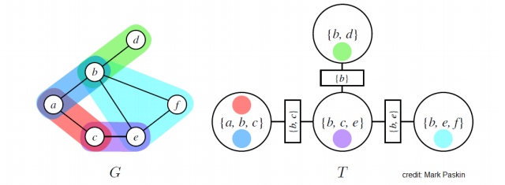

# Junction tree algorithm

Here we want to perform inference on a graph. In most cases this is not tractable. Thus we try to massage the graph into something that resembles a tree, and run message passing on this graph. We can view it as a generalization of  [belief propagation](belief_propagation.md) to graphs. 

## Junction trees
The idea behind junction three algorithm is to turn a graph into a tree of clusters, that are amenable to variable elimination ([Example](junction_tree_example.md)). Than we perform message passing on this tree.

Suppose we have an undirected graphical model G (or normalized directed). A junction tree $T=(C,E_T)$ over $G=(X,E_G)$ is a tree whose nodes $c \in C$ are associated with subsets $x_c \in X$ of the graph vertices (sets of variables); the junction tree has to satisfy:

* Family preservation: For each factor $\phi$, there is a cluster $c$ such that $\text{Scope}[\phi] \in x_c$
* Running intersection: For every pair of clusters $c^{(i)}, c^{(j)}$, every cluster on the path between $c^{(i)}, c^{(j)}$ contains $x_c^{(i)} \cap x_c^{(j)}$

> Example
> 
> A Graph G and junction tree T. MRF potentials are denoted using different colors, circles are nodes of a junction tree, rectangular nodes are sepsets (separation sets), which is a set of variables shared by neighboring clusters
> 
> 

There always exists a trivial junction tree that has one node containing all the variables, however this will result in inefficient marginalization algorithm.

Optimal trees have small and modular clusters. Finding an optimal tree is NP-hard. Thus we use heuristics to find "good junction trees". (There is a special case when we can find an optimal junction tree when G is a tree. Than we define an cluster for each edge in the tree.)

## JT Algorithm
It an form of message passing, it can be viewed as [variable elimination](variable_elimination.md) on a junction tree.

First we define the potential $\psi_c(x_c)$ for each cluster c as the product of all the factors in $\phi$ in G that have been assigned to c. (this is well defined because of family preservation property). We get the following joint distribution:

$$
p(x_1, \cdots, x_n) = \frac{1}{N} \prod_{c \in C}\psi_c(x_c)
$$

At each step we choose a pair of adjacent clusters $c^{(i)}, c^{(j)}$ in T and compute a message whose scope is the sepset S_{ij} between two clusters.

$$
m_{i\rightarrow j}(S_{ij}) = \sum_{x_c \backslash S_{ij}} \psi_c(x_c)\prod_{l \in N(i) \backslash j} m_{l \rightarrow i}(S_{li})
$$

We choose $c^{(i)}, c^{(j)}$ only if $c^{(i)}$ has received messages from all of its neighbors except $c^{(j)}$. This procedure terminates in $2|E_T|$ steps. After termination we define the belief for each cluster based on all the messages that it receives:

$$
B_c(x_c) = \psi_c(x_c) \prod_{l \in N(i)} m_{l \rightarrow i}(S_{ij})
$$

This updates are known as *Shafer-Shenoy*. After all the messages have been passed, beliefs will be proportional to the marginal probabilities over their scopes $B_c(x_c) \propto p(x_c)$. We can answer queries of the form $\tilde{p}(x)$ for $x \in x_c$ by marginalizing the variable in its belief:

$$
\tilde{p}(x) = \sum_{x_c \backslash c} B_c(x_c)
$$

To get normalized probabilities we divide by the partition function:

$$
Z = \sum_{x_c}B_c(x_c)
$$

We prefer small clusters, the run time is exponential in the size of the largest cluster (marginalizing out variables from cluster has to be done brute force).

## Limitations
Does not work with continuous variables, unless we have joint Gaussian distributions.