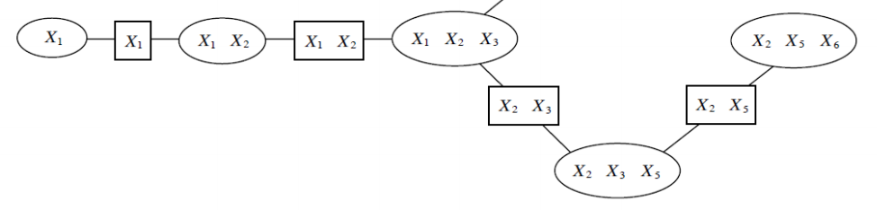

# Junction tree example

Lets define the following [MRF](markov_random_fields.md):

$$
p(x_1, x_2, \cdots, x_n) = \frac{1}{Z}\prod_{c \in C} \phi_c(x_c)
$$

We assume that cliques $c$ have some path structure, meaning that we can find an ordering $x_c^{(1)}, x_c^{(2)}, \cdots, x_c^{(n)}$ with property that $x_i \in x_c^{(j)}$ and $x_i\in x_c^{(k)}$ for some variables $x_i$, then $x_i \in x_c^{(l)}$ for all $x_c^{(l)}$ on the path between $x_c^{(l)}$ and $x_c^{(k)}$.
This assumption is known as **running intersection (RIP)** property.

> This is an MRF whose cliques are organized in a chain structure. Round nodes are cliques and variables in their scope; rectangular nodes are sepsets, which are variables forming the intersection of two neighboring cliques.

We can compute the marginal probability $p(x_1)$, by using a form of [variable elimination](variable_elimination.md) to "push" certain variables deeper into the product of cluster potentials.

$$
\phi(x_1) \sum_{x_2}\phi(x_1, x_2)\sum_x \phi(x_1, x_2, x_3)\sum_{x_5}\phi(x_1, x_3, x_5)\sum_{x_6}\phi(x_2, x_5, x_6)
$$

Here we first eliminate $x_6$ which creates a factor 

$$\tau(x_2,x_3, x_5) = \phi(x_2, x_3, x_5)\sum_{x_6}\phi(x_2,x_5,x_6)$$

Than we continue with $x_5$ and so on.

At each step we marginalize out the variables that are not in the scope of its neighbors. (this marginalization can be viewed as computing messages over variables it shares with the neighbor).

Running intersection property is what enables to push sums in all the way to the last factor. We eliminate $x_6$ since we know that only the last cluster will carry this variable (not present in neighboring cluster), it cannot be anywhere else in the graph without violating the Running intersection property. 
