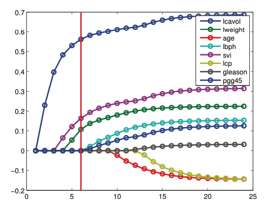

# $l_1$ regularization

Here we encourage $w_j=0$ by a prior on $w$ that assigns a lot of probability density near the origin such as a zero-mean Laplace distribution. This should yield an [sparse solution](l1_regularization_sparse_solution.md).

$$p(w|\lambda) = \prod_{j=1}^D Lap(w_j|0,1/\lambda) \propto \prod_{j=1}^D e^{-\lambda |w_j|}$$

## MAP estimation
We can view $l_1$ regularization as using Laplace prior and performing MAP estimation. This is also known as the [Lasso](lasso_optimality_conditions.md) algorithm.

If we assume an uniform prior on the bias term $p(w_0)) \propto 0$ and perform MAP estimation with this prior. The penalized negative log likelihood has the form:

$$
f(w) = - \log p(D|w) - log p(w|\lambda) = NLL(w) + \lambda ||w||_1
$$

* $||w||_1 = \sum_{j=1}^D|w_j|$ is the $l_1$ norm of w.

For a suitably large $\lambda$ the estimate $\hat{w}$ will be sparse. We can view this as an convex approximation to

$$
\argmin w NLL(w) + \lambda ||w||_0
$$
the $l_0$ regularization ([Bernoully Gaussian Model](bernoulli_gaussian_model.md))

For [linear regression](linear_regression.md) this becomes:

$$
f(w)  = RSS(w) + \lambda'||w||_1
$$
* $\lambda' = 2\lambda \sigma^2$

### Regularizaton path
As we increase $\lambda$ the solution to $\hat{w}(\lambda)$ will tend to get sparser  (not necessarily monotonically). If we plot $\hat{w}(\lambda)$ vs $\lambda$ for each j, we get the **regularization path**.

Here we plot the regularzation path for $t = \frac{1}{\alpha}$ this a smaller value of $t$ yield larger $\alpha$

### High dimension
In case $N> D$ then lasso can select at most N nonzero parameters.

### Model selection

It is tempting to use $l_1$ regularization to estimate a set of relevant variables. In some cases we can recover the true parameters $w^*$. If a model can recover the parameters as $N \rightarrow \infty$ than we can say that the **model selection is consistent**.

However $l_1$ regularziation cannot guarantee this.

1. Since the parameters a shunken, to recover the true data generating parameters we may first find the non-zero parameters, and on those parameters we fit regular OLS. This process is called **debiasing**
2. If the data is perturbed slightly, then $l_1$ regularization can give quite different results. We can however use boostrap to find the most stable ones.

# Fitting
In general the fastest is to use [coordinate descent](./coordinate_descent.md)

Alterantively we can use proximal gradient descent.

# Variants

## Fused lasso

In some problem settings (e.g., functional data analysis), we want neighboring coefficients to be similar to each other (function becomes smoother), in addition to being sparse. This can be done by using a special prior.

## Group lasso

Here we group features into groups and each group has a separate regularization tuning parameter.

## Nonconvex regularizisers

Here we put a prior that has an larger spike at 0 and heavier tails than the laplace prior.

* [bridge regression](bridge_regression.md)
* [hierarchical adaptive lass](hierarchical_adaptive_lasso.md)